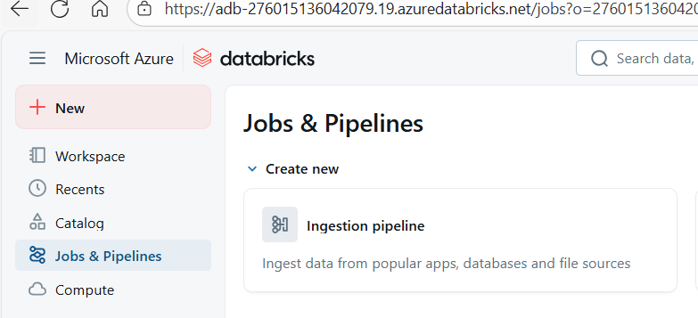
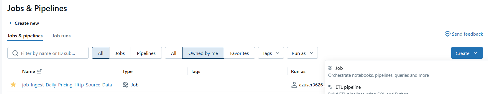
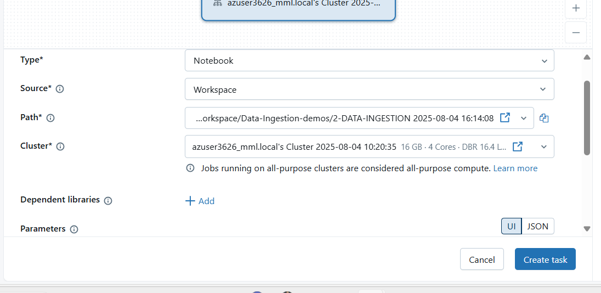
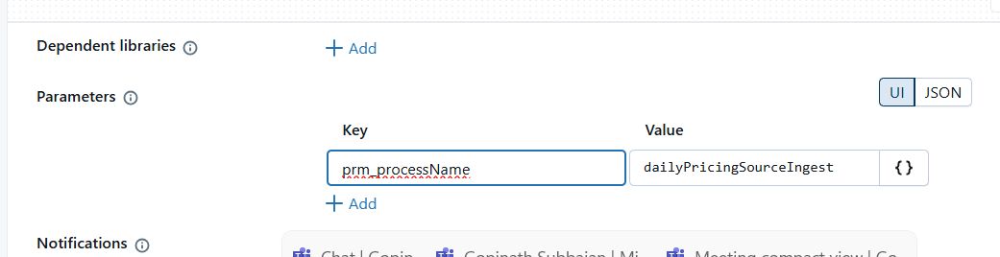
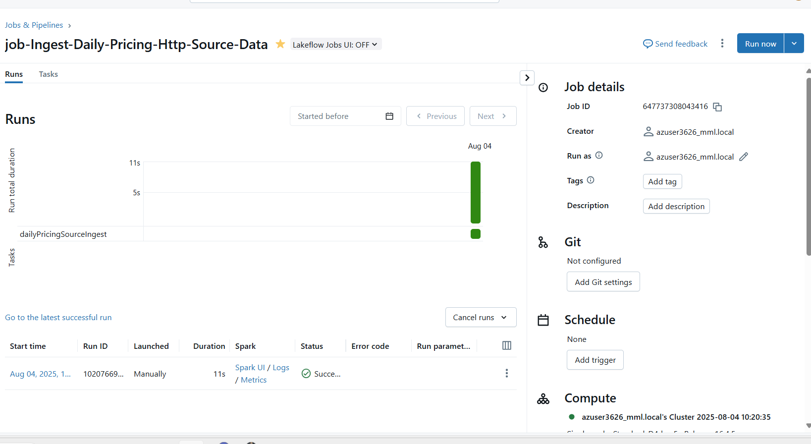

Create a new Job

job Name: job-Ingest-Daily-Pricing-Http-Source-Data

What is Task?

Taskname :dailyPricingSourceIngest
Type :Notebook,sql,Run job(it can run another job),...
path : select the notebook which has the code to do the particular task

cluster :Choose the running Cluster
parameters : If notebook is having parameter pass the value for the parameter

create task

Run the Task .-> once you click the run task it will execute or run the block of cell which return one by one

