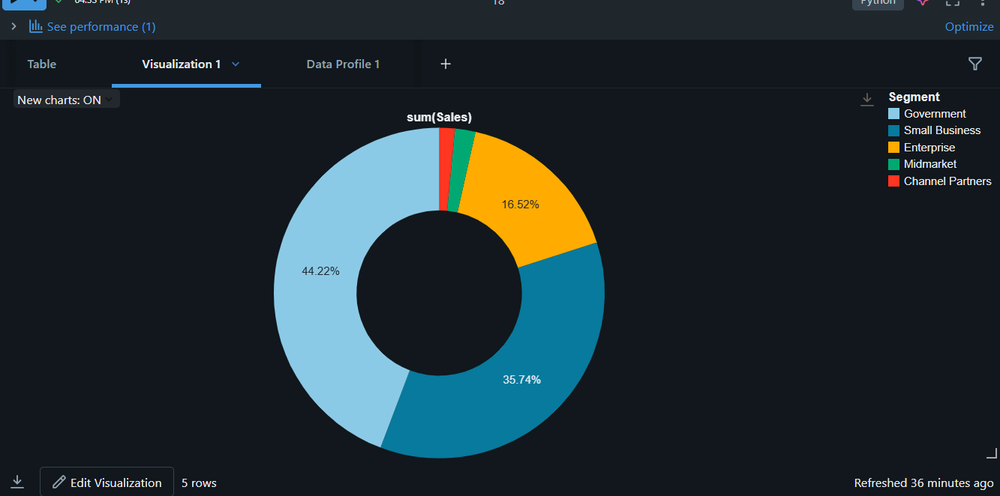

# 📊 Real-World Visualization Scenarios using PySpark in Databricks (Community Edition)

This guide demonstrates how to build various types of charts (bar, line, pie, area, scatter, etc.) in **Databricks Community Edition (serverless)** using your uploaded Excel data (`Financial Sample (2).xlsx`).

---

## 📁 Step 1: Upload & Read Excel File

```python
%pip install openpyxl
```

```python
import pandas as pd

excel_path = "/dbfs/FileStore/tables/financial_sample.xlsx"
pdf = pd.read_excel(excel_path, engine="openpyxl")
```

```python
df = spark.createDataFrame(pdf)
df = df.toDF(*[col.strip() for col in df.columns])  # Remove whitespace from column names
df.show(5)
```

---

## ✅ Step 2: Prepare Data

Add Month & Year columns if Date exists:

```python
from pyspark.sql.functions import month, year, col

df = df.withColumn("Month", month(col("Date")))
df = df.withColumn("Year", year(col("Date")))
```

---

## 📊 Scenario 1: Total Sales by Country – Bar Chart

```python
sales_by_country = df.groupBy("Country").sum("Sales").orderBy("sum(Sales)", ascending=False)
display(sales_by_country)
```

**Visualization Settings (from Databricks UI):**
- Chart Type: `Bar`
- X-Axis: `Country`
- Y-Axis: `sum(Sales)`

---

## 📊 Scenario 2: Profit vs Sales – Scatter Plot

```python
df2 = df.select("Sales", "Profit")
display(df2)
```

**Visualization Settings:**
- Chart Type: `Scatter`
- X-Axis: `Sales`
- Y-Axis: `Profit`

---

## 📊 Scenario 3: Sales by Segment – Pie Chart

```python
segment_sales = df.groupBy("Segment").sum("Sales")
display(segment_sales)
```

**Visualization Settings:**
- Chart Type: `Pie`
- Keys: `Segment`
- Values: `sum(Sales)`

---


## 📊 Scenario 4: Monthly Sales Trend – Line Chart

```python
from pyspark.sql.functions import month,year,sum

df=df.withColumn("Month",month(col("Date")))
df=df.withColumn("Year",year(col("Date")))
display(df.groupby("Month").sum("Sales").orderBy("Month"))
```

**Visualization Settings:**
- Chart Type: `Line`
- X-Axis: `Month`
- Y-Axis: `sum(Sales)`

---

## 📊 Scenario 5: Average Profit by Year – Area Chart

```python
yearly_profit = df.groupBy("Year").avg("Profit").orderBy("Year")
display(yearly_profit)

from pyspark.sql.functions import avg

display(df.groupBy("Year","Product").agg(avg("Profit").alias("Average_Profit")).orderBy("Year","Product"))
```

**Visualization Settings:**
- Chart Type: `Area`
- X-Axis: `Year`
- Y-Axis: `avg(Profit)`

---

## 📊 Scenario 6: Heatmap of Sales by Country & Segment

```python
heatmap_data = df.groupBy("Country", "Segment").sum("Sales")
display(heatmap_data)
```

**Visualization Settings:**
- Chart Type: `Heatmap`
- Keys: `Country`
- Series Grouping: `Segment`
- Values: `sum(Sales)`

---
## ✅ Summary Table

| Chart Type | Use Case | Spark Code |
|------------|----------|------------|
| Bar Chart | Sales by Country | `groupBy().sum().orderBy()` |
| Pie Chart | Sales by Segment | `groupBy().sum()` |
| Line Chart | Monthly Trend | `groupBy("Month")` |
| Area Chart | Yearly Avg Profit | `groupBy("Year")` |
| Scatter Plot | Profit vs Sales | `select()` |
| Heatmap | Sales by Country & Segment | `groupBy("Country", "Segment")` |

---

## 🚀 Tips
- Always use `display(df)` instead of `df.show()` to unlock charting
- Enable filters in the UI using the top-right “Filter” icon
- Export visualizations from Databricks for presentations


