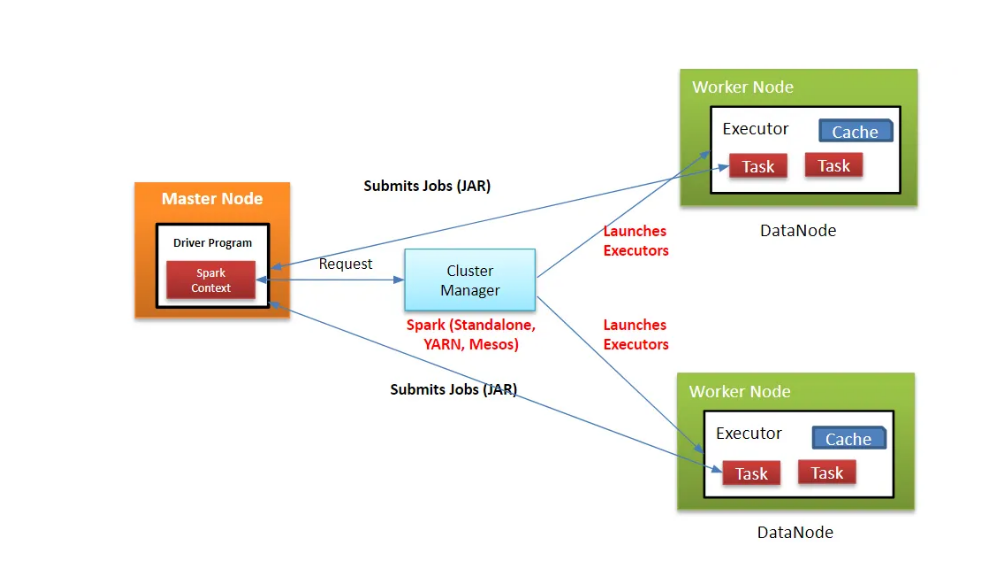

# Introduction to Apache Spark

Apache Spark is an open-source distributed computing system designed for big data processing and analytics. It is known for its **speed**, **efficiency**, and **ease of use**, making it a popular choice for handling large-scale data processing tasks.

Spark provides a **unified analytics engine** for large-scale data processing, with built-in modules for SQL, streaming, machine learning, and graph processing.

---

## What is the Use of Apache Spark?

- **Big Data Processing**: Spark is primarily used for processing large volumes of data quickly and efficiently.
- **Cluster Computing**: It enables distributed computing, allowing you to process data across multiple machines (nodes) in a cluster.
- **Versatile Workloads**: Spark supports batch processing, real-time streaming, interactive queries, machine learning, and graph processing.
- **Ease of Use**: It provides high-level APIs in Java, Scala, Python, and R, making it accessible to a wide range of developers.

---

## Apache Spark Architecture

Spark operates on a **master-slave architecture**:

# ⚙️ Apache Spark – Architecture and Execution Workflow

---

## 🔹 Key Components

### ✅ Driver Program
- The main entry point of any Spark application.
- It runs the `main()` method.
- Responsible for creating the `SparkContext`.

### ✅ SparkContext
- The gateway to all Spark functionalities.
- Think of it like a **database connection**.
- All Spark commands flow through this object.

### ✅ Cluster Manager
- Manages resources across the cluster.
- Can be **Standalone**, **YARN**, **Mesos**, or **Kubernetes**.

### ✅ Worker Node
- Nodes in the cluster where the Spark application is executed.
- Hosts the **executors**.

### ✅ Executors
- Processes launched on **worker nodes**.
- Responsible for **executing tasks** assigned by the driver.
- Each Spark application has its own executors.

### ✅ Task
- A unit of work sent to an executor.
- One task per RDD partition per stage.
- Executes the **same code logic** over different data partitions.

---

## 🔹 Step-by-Step Working of Spark

### ▶️ Step 1: Code Submission
- User submits code with **transformations** and **actions**.

### ▶️ Step 2: DAG Creation
- The **Driver** converts the code into a **DAG (Directed Acyclic Graph)**.
- Applies **optimization** like pipelining transformations.

### ▶️ Step 3: Physical Plan
- Driver converts DAG into a **Physical Execution Plan** with stages.

### ▶️ Step 4: Task Creation
- Driver creates **tasks** under each stage.

### ▶️ Step 5: Resource Allocation
- Driver contacts **Cluster Manager** to request resources.

### ▶️ Step 6: SparkContext Initialization
- SparkContext is initialized to begin communication with the cluster.

### ▶️ Step 7: Executor Launch
- Cluster Manager launches **executors** on available worker nodes.

### ▶️ Step 8: Task Assignment
- Driver assigns tasks to executors based on **data locality**.

### ▶️ Step 9: Executor Registration
- Executors register themselves with the **Driver**.
- Driver gains full visibility of active executors.

### ▶️ Step 10: Task Execution
- Executors execute assigned tasks.
- Driver monitors their progress.

### ▶️ Step 11: Completion and Cleanup
- When `sc.stop()` is called:
  - Executors shut down.
  - Resources are released from the cluster manager.

---

## 📌 Summary
Apache Spark uses a **central driver** to coordinate tasks across a cluster of **worker nodes** using **executors**. The system follows an optimized DAG execution model that ensures efficient and parallel data processing across large datasets.

- **Driver (Master)**:  
  The driver is the "brain" of Spark. It manages job scheduling, converts user code into tasks, assigns them to executors, and monitors progress.

- **Cluster Manager**:  
  This manages resources across the cluster (e.g., YARN, Mesos, Kubernetes, or Spark’s standalone cluster manager).

- **Workers (Slaves)**:  
  Worker nodes execute the tasks assigned by the driver. Each worker node runs one or more **executors** (JVM processes responsible for running tasks and storing data in memory or disk).

- **Executors**:  
  These are launched at the start of a Spark application and run tasks and store data for that application.

---

## Spark Ecosystem Components

- **Spark Core**: The foundation for all Spark functionality, handling basic I/O, scheduling, and memory management.
- **Spark SQL**: For structured data processing using SQL queries.
- **Spark Streaming**: For real-time data processing.
- **MLlib**: Machine learning library.
- **GraphX**: For graph processing.

---

## Spark Application Workflow

1. User submits a Spark application (written in Python, Scala, etc.).
2. The **driver program** splits the application into tasks.
3. Tasks are distributed to **worker nodes**.
4. Results are collected and returned to the **driver**.

---
