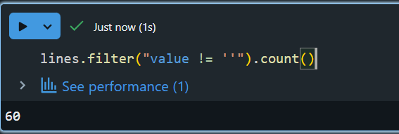

diff b/w file and RDD




# after removed empty string lines count of lines from 95 to 60
lines.filter("value != ''").count()

```spark
%fs ls dbfs:/databricks-datasets/online_retail
```
# How to upload data


Volume created successfully


