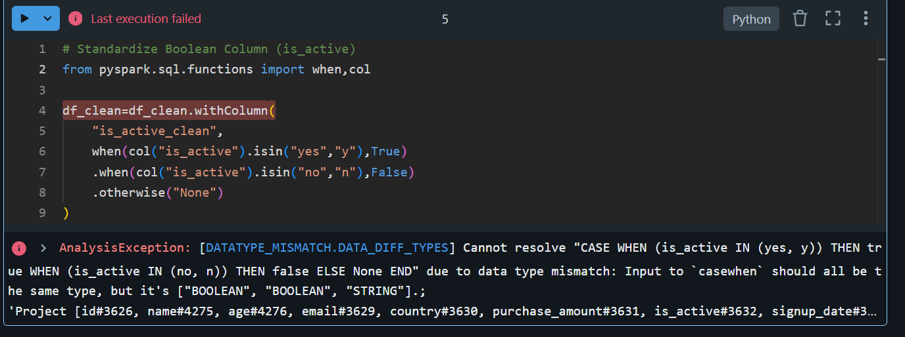

# 🧠 Spark ELT Pipeline in Databricks (Community Edition) – PySpark Tutorial

This guide walks you through a full end-to-end **ELT (Extract → Load → Transform)** pipeline using PySpark in **Databricks Community Edition** with a free sample dataset.

---

## 📁 Step 1: Upload the Dataset

- Upload the file `data_uncleaned.csv` into Databricks from your local machine.
- Target path after upload: `/FileStore/tables/data_uncleaned.csv`

---

## 🧾 Step 2: Read the CSV File

```python
# # Option 1: Spark SQL
# df = spark.sql("SELECT * FROM default.uncleaned_sample_dataset_2_csv")
# df.show()

# # Option 2: DataFrame API
# df = spark.read.table("default.uncleaned_sample_dataset_2_csv")
# df.show()

#  want to see where the physical data is stored:
spark.sql("DESCRIBE FORMATTED default.uncleaned_sample_dataset_2_csv").show(truncate=False)
```

---

## 🧪 Step 3: Explore the Schema

```python
# Explore the Schema
df.printSchema()
df.describe()
```

---

## 🧼 Step 4: Data Cleaning & Transformation

### A. Handle Null Values

```python
df_clean = df.fillna({'name': 'Unknown', 'age': -1})
```

### B. Standardize Boolean Column (`is_active`)

```python
from pyspark.sql.functions import when, col

df_clean = df_clean.withColumn(
    "is_active_clean",
    when(col("is_active").isin("yes", "y"), True)
    .when(col("is_active").isin("no", "n"), False)
    .otherwise(None)
)
```

### C. Validate Email Format

```python
from pyspark.sql.functions import regexp_extract

email_regex = r'^[a-zA-Z0-9._%+-]+@[a-zA-Z0-9.-]+\.[a-zA-Z]{2,}$'
df_clean = df_clean.withColumn("is_valid_email", regexp_extract(col("email"), email_regex, 0) != "")
```

### D. Parse Dates and Drop Bad Records

```python
from pyspark.sql.functions import to_date

df_clean = df_clean.withColumn("signup_date_parsed", to_date("signup_date", "yyyy-MM-dd"))
df_clean = df_clean.na.drop(subset=["signup_date_parsed"])
```

---

## 💾 Step 5: Save Transformed Data

### Save as Parquet

```python
df_clean.write.mode("overwrite").parquet("/FileStore/tables/data_cleaned_parquet")
```

### Save as CSV

```python
df_clean.write.mode("overwrite").option("header", True).csv("/FileStore/tables/data_cleaned_csv")
```

---

## ✅ Summary of Key Transformations

| Transformation Type         | Operation Done                                  |
|-----------------------------|--------------------------------------------------|
| Null Handling               | `fillna()` and `dropna()`                        |
| Data Standardization        | `withColumn()` with `when()` for booleans        |
| Validation (Regex)          | `regexp_extract()` for email                     |
| Date Parsing & Filtering    | `to_date()` and null checks                      |
| Format Conversion           | Saved to Parquet and CSV                         |

---

> Created for use with Databricks Community Edition using PySpark.
