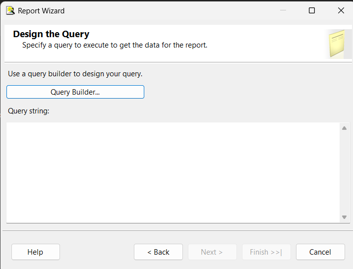
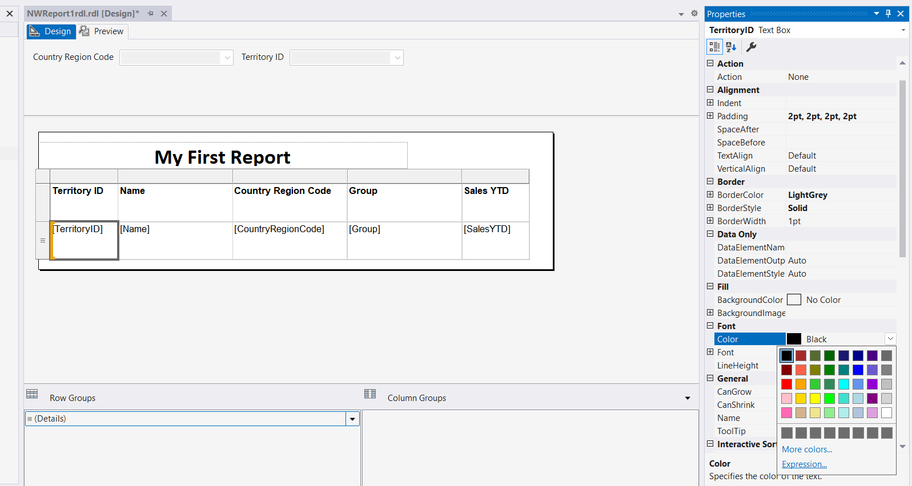

## Non wizard Report

Report Server Project


```sql
SELECT TOP (1000) [TerritoryID]
      ,[Name]
      ,[CountryRegionCode]
      ,[Group]
      ,[SalesYTD]
      ,[SalesLastYear]
      ,[CostYTD]
      ,[CostLastYear]
      FROM [AdventureWorks2014].[Sales].[SalesTerritory] 


SELECT TOP (1000) [TerritoryID]
      ,[Name]
      ,[CountryRegionCode]
      ,[Group]
      ,[SalesYTD]
      ,[SalesLastYear]
      ,[CostYTD]
      ,[CostLastYear]
      FROM [AdventureWorks2014].[Sales].[SalesTerritory] where CountryRegionCode=@CountryRegionCode

```

      Right click ->Add Dataset
      

```sql
SELECT 
      Distinct CountryRegionCode    
      FROM [AdventureWorks2014].[Sales].[SalesTerritory]
```


Double click parameters in Report data Toolbox


## Next will add one more parameter
```sql
SELECT TOP (1000) [TerritoryID]
      ,[Name]
      ,[CountryRegionCode]
      ,[Group]
      ,[SalesYTD]
      ,[SalesLastYear]
      ,[CostYTD]
      ,[CostLastYear]
      FROM [AdventureWorks2014].[Sales].[SalesTerritory] where CountryRegionCode=@CountryRegionCode
AND TerritoryID=@TerritoryID
```


# Let us Add cascading parameter based on we need to list related item in the next dropdown
For our example  above countrRegionCode once you selected conuntrycode as 'US' TerritoryID should list out automatically in the next dropdown


### Add New Dataset ->param_TerritoryID
``sql
SELECT 
DISTINCT TerritoryID 
 FROM [AdventureWorks2014].[Sales].[SalesTerritory] where CountryRegionCode=@CountryRegionCode

```


Attach dataset to parameter


# Expression

Expression is statement

Add TerritoryId column in the table





=Fields!SalesYTD.Value+10000


Add another textbox -> Expression


="Language = "+User!Language+"Page Number :"+Globals!PageNumber

as we are getting the error
# Let us Add PAge Header


Place textbox 
