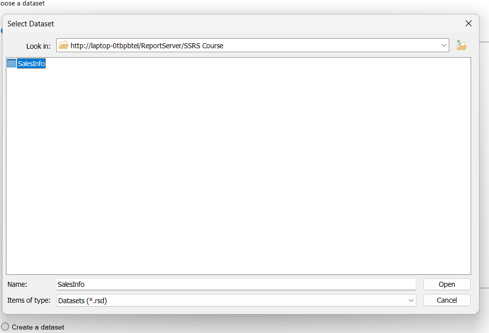
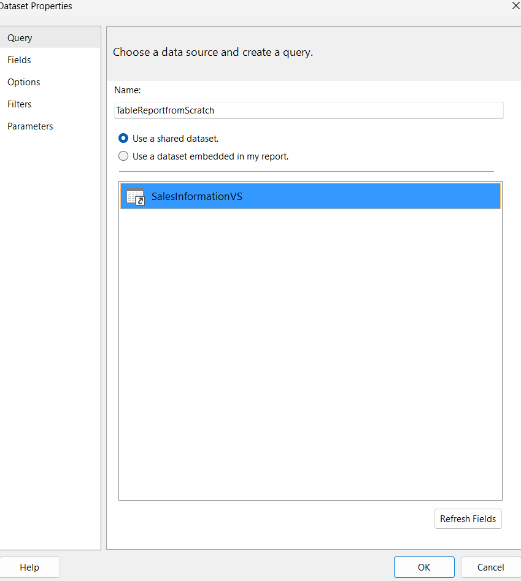
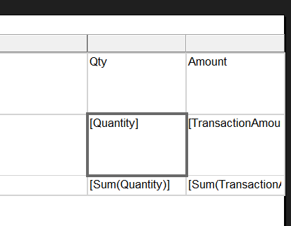
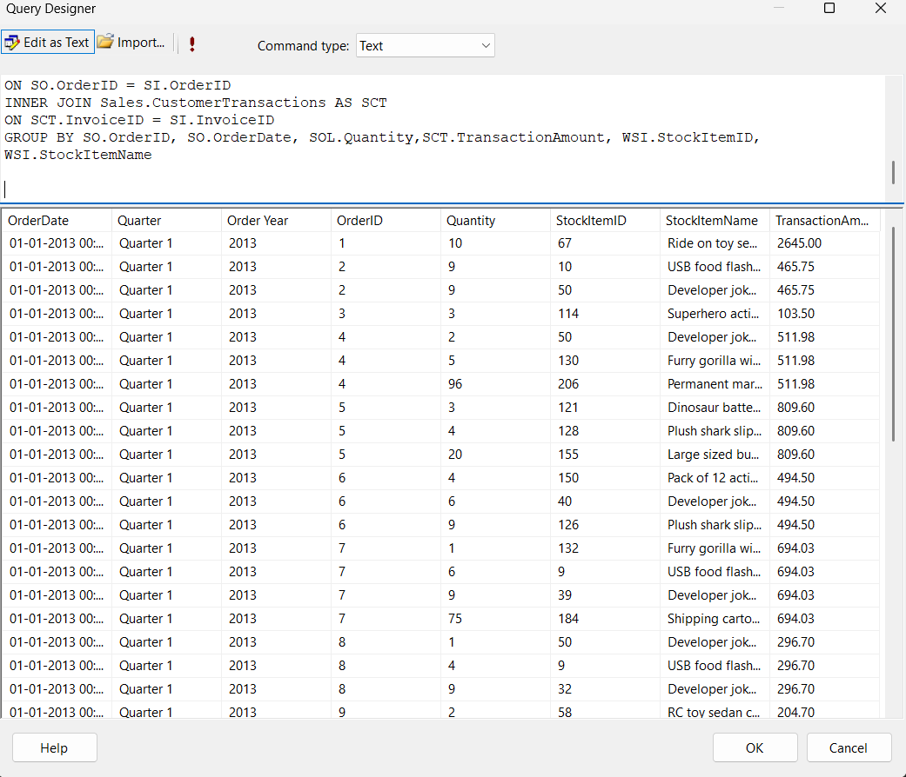

open Microsoft report builder

choose table or matrix wizard

 -> Click on Browse

Select the header Row

in view Mode ->select grouping

view tab-> Uncheck the grouping
Goto ->Home Tab => Run 

Now title visible in all pages . To check navigate to last page,..
and check

we created report using Microsoft Report Builder

Now come back vs 2022 ->

ok

If not available -> View tab ->Report Data

another way to create new column

Preview

Now check the connection string in SalesInfo
 Data Source -> Re configure =>Test Connection
 
 

 There is no grouping and format for order date
 let us do it

 

 

 
 
 
 
 

 Add Total
 

 

 

 

 Grand Total

 

 
   
 

 

 ## Repeat Header Row on Each Page in Visual Studio 2022
 ## ✅ Repeat Table Header on Each Page in SSRS (Visual Studio 2022)

### 🔹 1. Open Your Report (`.rdl`) in Design View
- Make sure you are in the **Design** tab (not Preview).

---

### 🔹 2. Click on the Table or Tablix
- Click anywhere inside your table (your data grid).
- In the top-left corner of the table, click the **small square handle** to select the whole table.

---

### 🔹 3. Open the Row Groups Pane
- If it's hidden, go to:
View > Grouping

- You’ll see a panel with **Row Groups** and **Column Groups**.

---

### 🔹 4. Right-Click the Top-most `(static)` Row in Row Groups
- In the **Row Groups** pane, find the top `(static)` group — this represents your **header row**.
- Right-click → **Properties**.

---

### 🔹 5. Enable Repeat Options in Properties
Set the following:

- `RepeatOnNewPage = True`
- `KeepWithGroup = After`
- `FixedData = True` *(optional – keeps the header visible while scrolling)*

---

### 🔹 6. Save and Preview
- Save the `.rdl` file.
- Click the **Preview** tab.

✅ Now the **header row should repeat on all pages**.

Select Column header Row -> make it bold

We are goig to so the same report using Wizard

