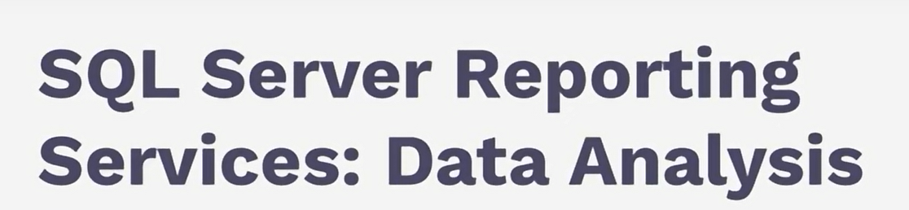

SSRS components and Tools

Datasources 
connectionstrings

vs 2022
Microsoft report builder

Module 1:
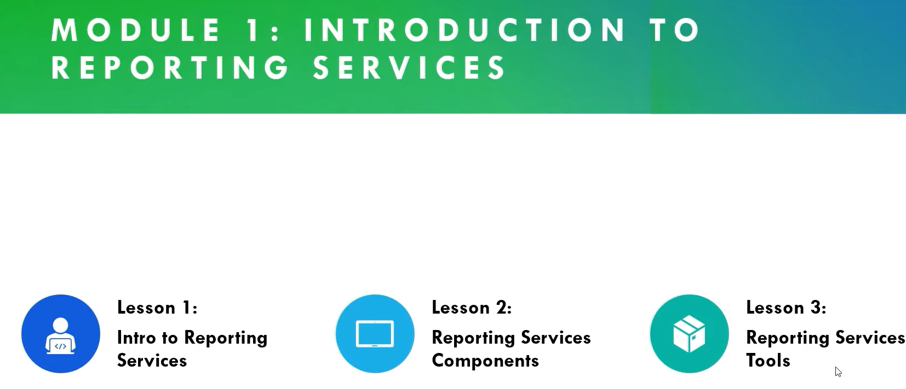

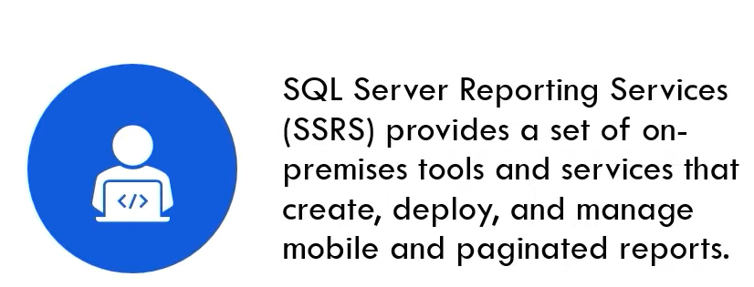

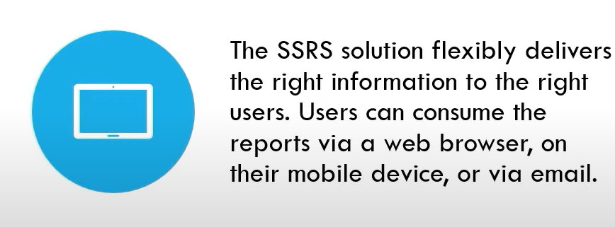

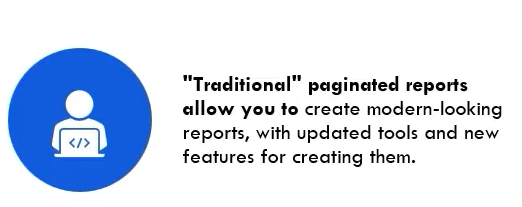

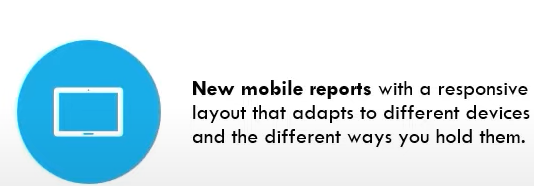

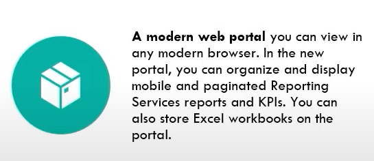

# Module 2

Reporting Services Components

- Report Designer
- Report builder
- Reporting Services
- Web Portal
  
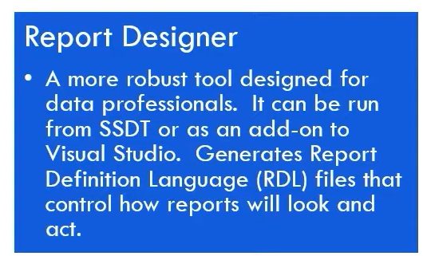

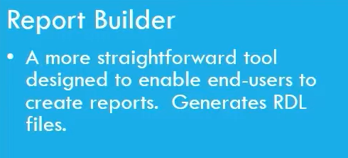

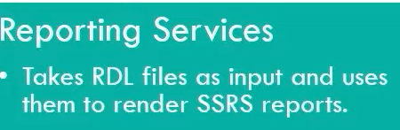

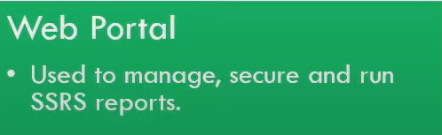

# Module 3: 
## Reporting Services Tools

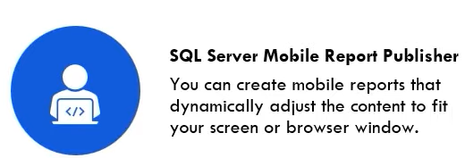

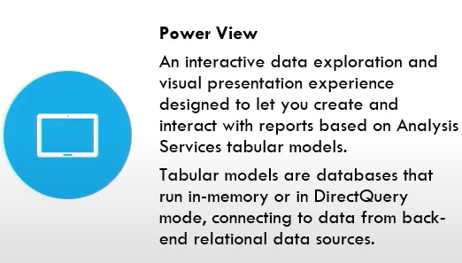

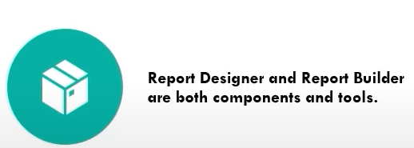

## Tools for Report Server Administration
it has 2 modes

## 1.Native mode
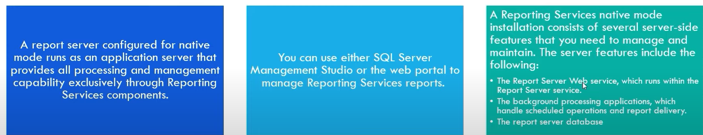

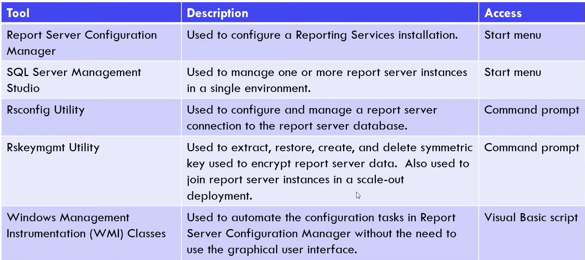

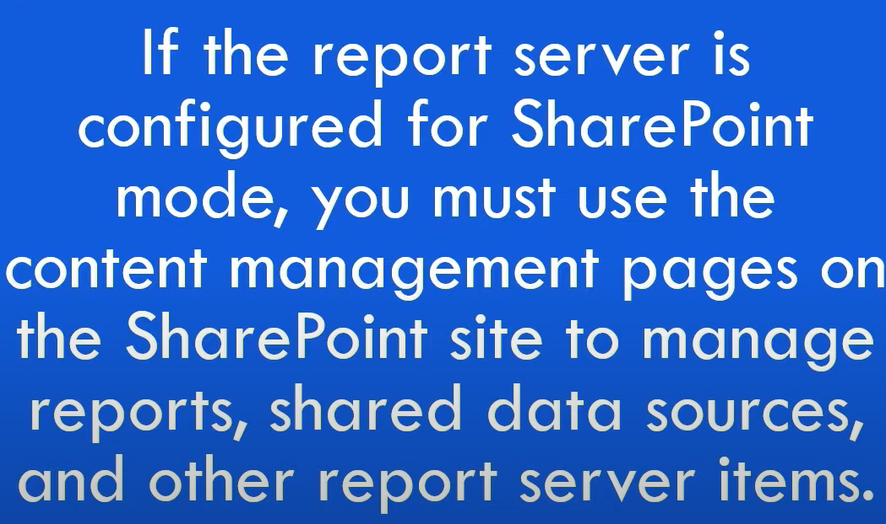

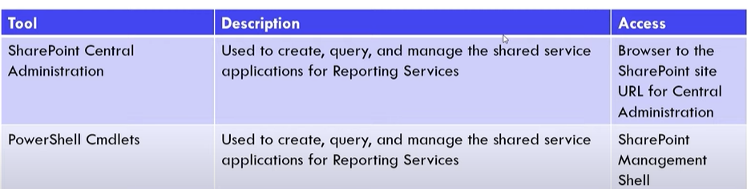

## Tools For Report Content Management
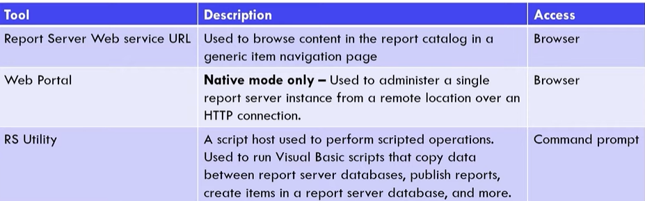

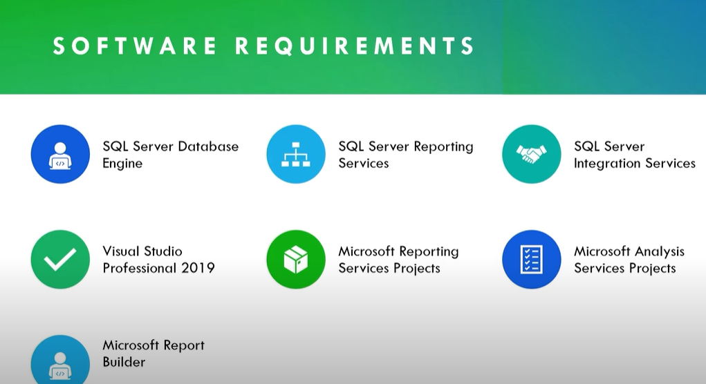 

