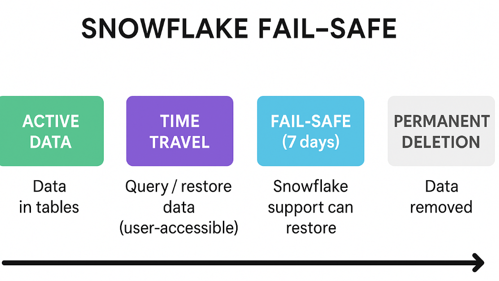

# ❄️ Snowflake Fail-safe

## Definition

Fail-safe in Snowflake is a **7-day period after the Time Travel
retention period** during which Snowflake can recover historical data
that has been deleted or modified.

-   Unlike **Time Travel**, Fail-safe is **not user-accessible**.\
-   Only **Snowflake Support** can restore data from Fail-safe if you
    raise a support ticket.\
-   It exists for **disaster recovery** purposes (like system failures,
    not normal user mistakes).

------------------------------------------------------------------------

## How it Works

1.  **Active Data** → Data is in tables and available for queries.\
2.  **Time Travel Period (0--90 days)** → You can manually query, clone,
    or restore dropped tables.\
3.  **Fail-safe Period (7 days fixed)** → After Time Travel expires,
    data goes into Fail-safe.
    -   You cannot access it yourself.\
    -   Snowflake Support can restore it if necessary.\
4.  **Permanent Deletion** → After fail-safe expires, data is completely
    removed.

------------------------------------------------------------------------

## Key Points

-   Fail-safe applies to **permanent tables only** (not temporary or
    transient).\
-   Purpose: **Disaster recovery**.\
-   Costs: Storing data in fail-safe incurs storage charges.

------------------------------------------------------------------------


## Example

``` sql
-- Create table
CREATE OR REPLACE TABLE sales_data (
   order_id INT,
   amount FLOAT,
   order_date DATE
);

-- Drop table
DROP TABLE sales_data;
```

-   If `DATA_RETENTION_TIME_IN_DAYS = 1`, you can still recover within
    **1 day** using Time Travel:

``` sql
UNDROP TABLE sales_data;
```

-   After **1 day**, Time Travel expires.\
-   For the next **7 days**, the data is in **Fail-safe**.\
-   You cannot run `UNDROP` anymore; only **Snowflake Support** can
    help.

------------------------------------------------------------------------

## Real-world Example

A retail company loads daily sales data into Snowflake.\
- **Time Travel = 2 days**.\
- On **Monday**, a user accidentally drops the `sales_data` table.\
- On **Tuesday**, admin restores it using `UNDROP TABLE` ✅.\
- On **Friday**, Time Travel expired → must contact **Snowflake
Support** to recover it from Fail-safe.\
- After **9 days total**, data is permanently lost.

------------------------------------------------------------------------


