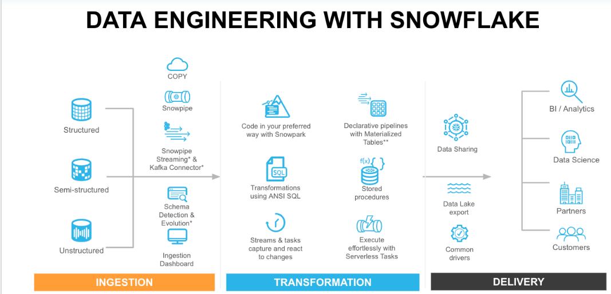
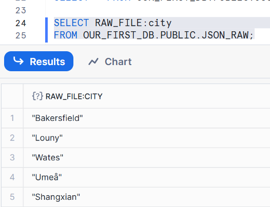

## Creating stage & raw file

# Snowflake Notes – Load Raw JSON  

## 1. Create External Stage
```sql
CREATE OR REPLACE STAGE MANAGE_DB.EXTERNAL_STAGES.JSONSTAGE
     URL='s3://bucketsnowflake-jsondemo';
```
🔹 **Explanation**  
- Creates (or replaces) an external **stage** named `JSONSTAGE` inside schema `MANAGE_DB.EXTERNAL_STAGES`.  
- The stage points to the S3 bucket `s3://bucketsnowflake-jsondemo`.  
- This is where Snowflake will look for files (in this case, the JSON file).  

✅ **Output**  
```
Statement executed successfully.
```

---

## 2. Create File Format
```sql
CREATE OR REPLACE FILE FORMAT MANAGE_DB.FILE_FORMATS.JSONFORMAT
    TYPE = JSON;
```
🔹 **Explanation**  
- Defines how Snowflake should read files.  
- `TYPE = JSON` means the files will be interpreted as JSON objects/arrays.  
- This file format will be reused in the COPY command.  

✅ **Output**  
```
Statement executed successfully.
```

---

## 3. Create Target Table
```sql
CREATE OR REPLACE TABLE OUR_FIRST_DB.PUBLIC.JSON_RAW (
    raw_file VARIANT
);
```
🔹 **Explanation**  
- Creates a table `JSON_RAW` inside `OUR_FIRST_DB.PUBLIC`.  
- The column `RAW_FILE` is of type `VARIANT`, Snowflake’s special type for storing semi-structured data (JSON, Avro, Parquet, etc.).  
- Each row will hold one JSON object or element.  

✅ **Output**  
```
Table JSON_RAW successfully created.
```

---

## 4. Load Data with COPY INTO
```sql
COPY INTO OUR_FIRST_DB.PUBLIC.JSON_RAW
    FROM @MANAGE_DB.EXTERNAL_STAGES.JSONSTAGE
    FILE_FORMAT = MANAGE_DB.FILE_FORMATS.JSONFORMAT
    FILES = ('HR_data.json');
```
🔹 **Explanation**  
- Loads data from the stage into the `JSON_RAW` table.  
- `@MANAGE_DB.EXTERNAL_STAGES.JSONSTAGE` → points to the stage where the file lives.  
- `FILE_FORMAT = MANAGE_DB.FILE_FORMATS.JSONFORMAT` → tells Snowflake how to interpret the file.  
- `FILES = ('HR_data.json')` → loads only this specific file.  

✅ **Typical Output**  


---

## 5. Query the Raw Data
```sql
SELECT * FROM OUR_FIRST_DB.PUBLIC.JSON_RAW;
```
🔹 **Explanation**  
- Retrieves all rows from the `JSON_RAW` table.  
- Each row contains the JSON content inside the `RAW_FILE` column.  
- Useful for validating that the data was loaded successfully.  

## Parsing JSON

## 1. Selecting attributes (direct JSON path)

```sql
SELECT RAW_FILE:city 
FROM OUR_FIRST_DB.PUBLIC.JSON_RAW;
```
🔹 **Explanation**  
- `RAW_FILE` is the `VARIANT` column holding JSON data.  
- Using the colon `:` path operator, we access the attribute `city`.  
- Each row will return the value of `"city"` if present in the JSON object.  

✅ **Example Output**  


---

```sql
SELECT $1:first_name 
FROM OUR_FIRST_DB.PUBLIC.JSON_RAW;
```
🔹 **Explanation**  
- `$1` is another way to refer to the first column (`RAW_FILE`) in the SELECT.  
- Extracts the `first_name` field from the JSON.  

✅ **Example Output**  

---

## 2. Selecting attributes with formatting (casting)

```sql
SELECT RAW_FILE:first_name::STRING AS first_name  
FROM OUR_FIRST_DB.PUBLIC.JSON_RAW;
```
🔹 **Explanation**  
- `::STRING` converts the JSON value to a native Snowflake `STRING` type.  
- Removes the surrounding quotes and lets you use it like a regular column.  

✅ **Output**  

----
```sql
SELECT RAW_FILE:id::INT AS id  
FROM OUR_FIRST_DB.PUBLIC.JSON_RAW;
```
🔹 **Explanation**  
- Extracts the `id` field and casts it to an integer.  
- Ensures numeric operations (e.g., sorting, aggregations) can be performed.  

✅ **Output**  


---

## 3. Selecting multiple attributes at once

```sql
SELECT 
    RAW_FILE:id::INT AS id,  
    RAW_FILE:first_name::STRING AS first_name,
    RAW_FILE:last_name::STRING AS last_name,
    RAW_FILE:gender::STRING AS gender
FROM OUR_FIRST_DB.PUBLIC.JSON_RAW;
```
🔹 **Explanation**  
- Extracts multiple fields from JSON in one query.  
- Each `::` cast ensures proper Snowflake data type conversion.  
- This is how you transform JSON into a more **tabular view** for analysis.  

✅ **Example Output**  

---

## 4. Handling nested JSON attributes

```sql
SELECT RAW_FILE:job AS job  
FROM OUR_FIRST_DB.PUBLIC.JSON_RAW;
```
🔹 **Explanation**  
- If the JSON has nested objects, e.g.:  
  ```json
  {
    "id": 101,
    "first_name": "Ava",
    "job": { "title": "Engineer", "dept": "IT" }
  }
  ```  
- This query returns the **nested JSON object** from `job`.  

✅ **Output Example**  
```
JOB
-----------------------------------------
{ "title": "Engineer", "dept": "IT" }
{ "title": "Manager", "dept": "HR" }
```

---

# Summary  

- Use `:` or `$1:` → to navigate inside JSON fields.  
- Use `::STRING`, `::INT`, etc. → to cast JSON values into proper Snowflake types.  
- Multiple attributes can be selected together to get a structured view.  
- Nested JSON objects can be retrieved directly and later expanded using `FLATTEN`.  


# Handling Nested Data

## A) Handling nested JSON objects (`job`)

### 1) Return the entire nested object
```sql
SELECT RAW_FILE:job AS job
FROM OUR_FIRST_DB.PUBLIC.JSON_RAW;
```
**Explanation**  
- Fetches the full `job` object from each row’s `RAW_FILE` (a `VARIANT`).  
- Useful to quickly see the structure under `job` (e.g., `title`, `salary`, `dept`).  

**Sample Output**
```
JOB
--------------------------------------------------------
{ "title": "Engineer", "dept": "IT", "salary": 120000 }
{ "title": "Manager",  "dept": "HR", "salary": 90000  }
```

---

### 2) Extract a nested scalar and cast it
```sql
SELECT RAW_FILE:job.salary::INT AS salary
FROM OUR_FIRST_DB.PUBLIC.JSON_RAW;
```
**Explanation**  
- Navigates into `job.salary` and converts it to `INT`.  
- If `salary` is missing or non-numeric, result is `NULL`.  

**Sample Output**


---

### 3) Select multiple nested fields at once
```sql
SELECT 
    RAW_FILE:first_name::STRING AS first_name,
    RAW_FILE:job.salary::INT     AS salary,
    RAW_FILE:job.title::STRING   AS title
FROM OUR_FIRST_DB.PUBLIC.JSON_RAW;
```
**Explanation**  
- Produces a tidy tabular set with typed columns pulled from nested paths.  

**Sample Output**

---

## B) Handling arrays 
```SQL
SELECT 
RAW_FILE:spoken_languages as spoken_languages
FROM OUR_FIRST_DB.PUBLIC.JSON_RAW;
```

```SQL
SELECT * FROM OUR_FIRST_DB.PUBLIC.JSON_RAW;

SELECT 
array_size (RAW_FILE:spoken_languages) as spoken_languages
FROM OUR_FIRST_DB.PUBLIC.JSON_RAW;
```


### 1) Return the entire array
```sql
SELECT RAW_FILE:prev_company AS prev_company
FROM OUR_FIRST_DB.PUBLIC.JSON_RAW;
```
**Explanation**  
- Returns the full array (still a JSON/`VARIANT` value).  

**Sample Output**
```
PREV_COMPANY
----------------------------------------
[ "Acme Corp", "Globex" ]
[ "Initech" ]
```

---

### 2) Index into an array element
```sql
SELECT RAW_FILE:prev_company[1]::STRING AS prev_company
FROM OUR_FIRST_DB.PUBLIC.JSON_RAW;
```
**Explanation**  
- Returns the **second** element (arrays are 0-based).  
- Casts to `STRING` for plain text.  
- Out-of-range indexes return `NULL`.  

**Sample Output**
```
PREV_COMPANY
-------------
Globex
NULL
```

---

### 3) Get the array length
```sql
SELECT ARRAY_SIZE(RAW_FILE:prev_company) AS prev_company
FROM OUR_FIRST_DB.PUBLIC.JSON_RAW;
```
**Explanation**  
- Returns the number of elements in the `prev_company` array.  

**Sample Output**
```
PREV_COMPANY
-------------
2
1
```

---

### 4) Project multiple array elements as separate rows (manual approach)
```sql
SELECT 
    RAW_FILE:id::int              AS id,  
    RAW_FILE:first_name::STRING   AS first_name,
    RAW_FILE:prev_company[0]::STRING AS prev_company
FROM OUR_FIRST_DB.PUBLIC.JSON_RAW
UNION ALL 
SELECT 
    RAW_FILE:id::int              AS id,  
    RAW_FILE:first_name::STRING   AS first_name,
    RAW_FILE:prev_company[1]::STRING AS prev_company
FROM OUR_FIRST_DB.PUBLIC.JSON_RAW
ORDER BY id;
```
**Explanation**  
- Creates **two passes** over the table:  
  - First SELECT pulls index `[0]` (first company).  
  - Second SELECT pulls index `[1]` (second company).  
- `UNION ALL` stacks them into one result set.  
- Out-of-range indexes yield `NULL`.  

**Sample Output**
```
ID  | FIRST_NAME | PREV_COMPANY
----+------------+--------------
101 | Ava        | Acme Corp
101 | Ava        | Globex
102 | Raj        | Initech
102 | Raj        | NULL
```

---

## Key Takeaways
- Use the `:` path operator to navigate nested objects and arrays inside `VARIANT`.  
- Always cast to Snowflake types (`::STRING`, `::INT`, …).  
- Arrays are 0-based; out-of-range indexes yield `NULL`.  
- `UNION ALL` can “stack” multiple projections (e.g., index 0 and 1) into one result set.  


```sql 
SELECT 
RAW_FILE:first_name::STRING as first_name,
array_size (RAW_FILE:spoken_languages) as spoken_languages
FROM OUR_FIRST_DB.PUBLIC.JSON_RAW;
```


```SQL
SELECT 
RAW_FILE:spoken_languages[0] as First_Language
FROM OUR_FIRST_DB.PUBLIC.JSON_RAW;
```


```sql
SELECT 
RAW_FILE:first_name::STRING as first_name,
RAW_FILE:spoken_languages[0] as First_Language
FROM OUR_FIRST_DB.PUBLIC.JSON_RAW;

```


- as the above result is nested structure **it is not easy analyse the data** 

- we need to form clean struncture for analytial purpose.
- as we know we can use . to access nested elements
  
```sql
SELECT
RAW_FILE:first_name::STRING AS First_name,
RAW_FILE:spoken_languages[0].language::STRING AS First_language,
RAW_FILE:spoken_languages[0].level::STRING as Level_spoken
FROM OUR_FIRST_DB.PUBLIC.JSON_RAW;
```

---

```sql
SELECT
RAW_FILE:id::int as ID,
RAW_FILE:first_name::STRING AS First_name,
RAW_FILE:spoken_languages[0].language::STRING AS First_language,
RAW_FILE:spoken_languages[0].level::STRING as Level_spoken
FROM OUR_FIRST_DB.PUBLIC.JSON_RAW
UNION ALL
SELECT
RAW_FILE:id::int as ID,
RAW_FILE:first_name::STRING AS First_name,
RAW_FILE:spoken_languages[1].language::STRING AS First_language,
RAW_FILE:spoken_languages[1].level::STRING as Level_spoken
FROM OUR_FIRST_DB.PUBLIC.JSON_RAW
UNION ALL
SELECT
RAW_FILE:id::int as ID,
RAW_FILE:first_name::STRING AS First_name,
RAW_FILE:spoken_languages[2].language::STRING AS First_language,
RAW_FILE:spoken_languages[2].level::STRING as Level_spoken
FROM OUR_FIRST_DB.PUBLIC.JSON_RAW
ORDER BY ID;

```


somehow it brokendown.This is not good solution an dit is complicated too.

- we have some other function to flattern this data

## Flattern
```sql
select
RAW_FILE:first_name::STRING as First_name,
f.value:language::STRING as Language,
f.value:level::STRING as Level_spoken
from OUR_FIRST_DB.PUBLIC.JSON_RAW, table(flatten(RAW_FILE:spoken_languages)) f;

```

