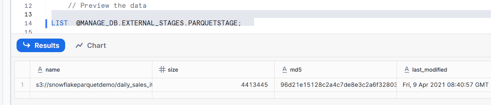
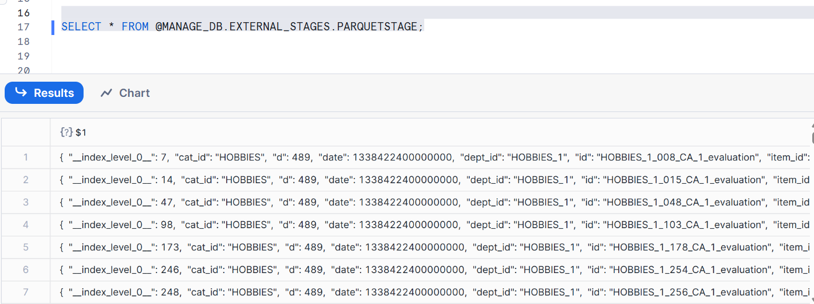

# Snowflake Notes – Working with Parquet Files  

---

## 1. Create File Format & Stage

```sql
CREATE OR REPLACE FILE FORMAT MANAGE_DB.FILE_FORMATS.PARQUET_FORMAT
    TYPE = 'parquet';

CREATE OR REPLACE STAGE MANAGE_DB.EXTERNAL_STAGES.PARQUETSTAGE
    URL = 's3://snowflakeparquetdemo'   
    FILE_FORMAT = MANAGE_DB.FILE_FORMATS.PARQUET_FORMAT;
```

🔹 **Explanation**  
- `FILE FORMAT`: Defines how Snowflake should interpret files → `TYPE = PARQUET`.  
- `STAGE`: Points to the S3 bucket where Parquet files are stored.  
- Linking the stage to a `FILE_FORMAT` makes querying/loading simpler later.

✅ **Output**  
```
File format PARQUET_FORMAT created successfully
Stage PARQUETSTAGE created successfully
```

---

## 2. Preview the Data

```sql
LIST @MANAGE_DB.EXTERNAL_STAGES.PARQUETSTAGE;   
```
- Lists all files inside the stage (S3 bucket).  

```sql
SELECT * FROM @MANAGE_DB.EXTERNAL_STAGES.PARQUETSTAGE;
```
- Returns metadata about the files (filename, size, etc.).  
- Does **not** return actual row data yet.  


---

## 3. Using File Format in Queries

### Option A: Specify `file_format` inline
```sql
SELECT * 
FROM @MANAGE_DB.EXTERNAL_STAGES.PARQUETSTAGE
(file_format => 'MANAGE_DB.FILE_FORMATS.PARQUET_FORMAT');
```

### Option B: Omit quotes if current namespace is set
```sql
USE MANAGE_DB.FILE_FORMATS;

SELECT * 
FROM @MANAGE_DB.EXTERNAL_STAGES.PARQUETSTAGE
(file_format => MANAGE_DB.FILE_FORMATS.PARQUET_FORMAT);
```

### Option C: Attach file format to stage
```sql
CREATE OR REPLACE STAGE MANAGE_DB.EXTERNAL_STAGES.PARQUETSTAGE
    URL = 's3://snowflakeparquetdemo'   
    FILE_FORMAT = MANAGE_DB.FILE_FORMATS.PARQUET_FORMAT;
```

🔹 **Explanation**  
- You can either:
  - Attach a file format to a stage permanently (Option C),  
  - Or specify it dynamically in the query (Option A/B).  
- Once defined, Snowflake knows how to parse Parquet rows into columns/fields.  

---

## 4. Syntax for Querying Unstructured Parquet Data

```sql
SELECT 
    $1:__index_level_0__,
    $1:cat_id,
    $1:date,
    $1:dept_id,
    $1:id,
    $1:item_id,
    $1:state_id,
    $1:store_id,
    $1:value
FROM @MANAGE_DB.EXTERNAL_STAGES.PARQUETSTAGE
(FILE_FORMAT => MANAGE_DB.FILE_FORMATS.PARQUET_FORMAT);
```

🔹 **Explanation**  
- `$1` refers to the full row in the Parquet file (as a `VARIANT`).  
- `:$field` extracts a field from the row (JSON-style navigation).  
- Quoted vs. unquoted field names → needed if column names contain special characters, uppercase, or reserved words.  

✅ **Output Example**  
```
__INDEX_LEVEL_0__ | CAT_ID | DATE | DEPT_ID | ITEM_ID | VALUE
------------------+--------+------+---------+---------+------
0                 | HOBB   | 2011 | HOBB_1  | ITEM_1  | 10
1                 | HOBB   | 2012 | HOBB_1  | ITEM_2  | 12
```

---

## 5. Date Conversion

```sql
SELECT 1;
```
- Simple test query (returns `1`).  

```sql
SELECT DATE(365*60*60*24);
```
- Demonstrates conversion of numeric values into date (Snowflake interprets integers as epoch seconds/days depending on usage).  
- Useful when Parquet stores dates as integers.  

---

## 6. Querying with Conversions & Aliases

```sql
SELECT 
$1:__index_level_0__::INT         AS index_level,
$1:cat_id::VARCHAR(50)            AS category,
DATE($1:date::INT )               AS Date,
$1:"dept_id"::VARCHAR(50)         AS Dept_ID,
$1:"id"::VARCHAR(50)              AS ID,
$1:"item_id"::VARCHAR(50)         AS Item_ID,
$1:"state_id"::VARCHAR(50)        AS State_ID,
$1:"store_id"::VARCHAR(50)        AS Store_ID,
$1:"value"::INT                   AS value
FROM @MANAGE_DB.EXTERNAL_STAGES.PARQUETSTAGE;
```

🔹 **Explanation**  
- Casts Parquet fields into proper Snowflake data types (`INT`, `VARCHAR`).  
- Adds **aliases** so the output looks like a normal relational table.  
- Converts `date` field (often stored as int in Parquet) into a Snowflake `DATE`.  

✅ **Sample Output**  
```
INDEX_LEVEL | CATEGORY |   DATE   | DEPT_ID | ID     | ITEM_ID | STATE_ID | STORE_ID | VALUE
------------+----------+----------+---------+--------+---------+----------+----------+------
0           | HOBB     | 2011-01-01 | HOBB_1 | ID_001 | ITEM_1  | CA       | STORE_1  |   10
1           | HOBB     | 2011-01-02 | HOBB_1 | ID_002 | ITEM_2  | TX       | STORE_2  |   12
```

---

# ✅ Key Takeaways

1. **File formats** define how Snowflake interprets Parquet/JSON/CSV/etc.  
2. **Stages** point to storage locations (S3, Azure, GCP).  
3. Parquet rows are accessed using `$1:fieldname`.  
4. Always cast (`::INT`, `::VARCHAR`, `DATE()`) for proper types.  
5. You can either:
   - Attach a file format to a stage permanently,  
   - Or specify it inline per query.  
6. This allows Parquet data to be queried like relational tables without loading into Snowflake tables first.  
