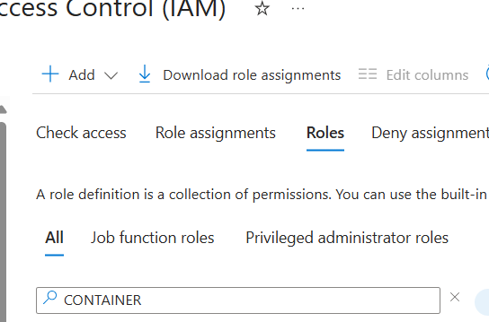
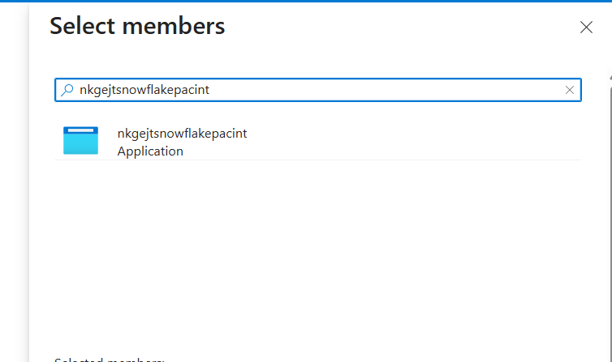

Login azure portal

create a storage account

storage account name :snowflakehexasa

Region : us-East (same as snowflake account region for production)


after creating storage account 
-> data storage 
-> container 
-> Add Container 
-> csv-container
-> upload
-> Add another container -> json-container


upload csv file into csv-container
same way upload json file into json-container

##  Create integration object

```sql

USE DATABASE DEMO_DB;
-- create integration object that contains the access information
CREATE STORAGE INTEGRATION azure_integration
  TYPE = EXTERNAL_STAGE
  STORAGE_PROVIDER = AZURE
  ENABLED = TRUE
  AZURE_TENANT_ID = '9ecede0b-0e07-4da4-8047-e0672d6e403e'
  STORAGE_ALLOWED_LOCATIONS = ('azure://storageaccountsnow.blob.core.windows.net/snowflakecsv', 'azure://storageaccountsnow.blob.core.windows.net/snowflakejson');

  
-- Describe integration object to provide access
DESC STORAGE integration azure_integration;
```








```sql
---- Query files & Load data ----

--query files
SELECT 
$1,
$2,
$3,
$4,
$5,
$6,
$7,
$8,
$9,
$10,
$11,
$12,
$13,
$14,
$15,
$16,
$17,
$18,
$19,
$20
FROM @demo_db.public.stage_azure;
```
