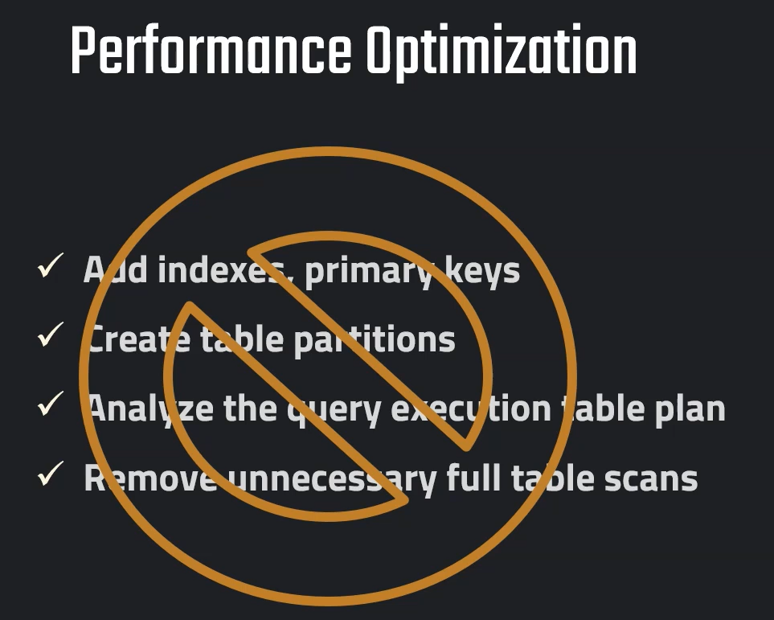

## **1. Dedicated Virtual Warehouses**
- **Definition**: A Virtual Warehouse in Snowflake is a compute cluster that executes queries and handles workloads.
- **Dedicated Warehouses** allow separation of workloads by assigning each workload (ETL, reporting, ML, ad-hoc queries) to its own compute cluster.
- **Advantages**:
  - Prevents resource contention between workloads.
  - Provides consistent performance for different user groups (e.g., BI analysts vs. data engineers).
  - Enables workload isolation, which makes it easier to troubleshoot performance issues.
- **Use Case**:
  - ETL processes run on one warehouse while dashboards run on another, avoiding slowdowns.
- **Key Point from Image**:  
  ✔ Separated according to different workloads.

  ## **2. Scaling Up**
- **Definition**: Increasing the size of a Snowflake Virtual Warehouse (e.g., from Small → Medium → Large) to provide more compute power.
- **How it Works**:
  - Scaling up increases CPU, memory, and I/O resources available for queries.
  - Queries that process large datasets or require high parallelism benefit from larger warehouses.
- **Advantages**:
  - Faster execution for compute-intensive queries.
  - Useful for predictable high workloads (batch jobs, month-end reporting).
- **Limitation**:
  - Scaling up increases cost since larger warehouses consume more credits.
- **Key Point from Image**:  
  ✔ For known patterns of high workload.

# **Snowflake – Performance Aspect: Scaling Out**

---

## **Scaling Out**
- **Definition**: Scaling out in Snowflake refers to adding more compute clusters to a **multi-cluster warehouse** so multiple clusters can process queries in parallel.  
- Unlike **scaling up** (increasing the size of one cluster), **scaling out** means running multiple clusters of the same size at the same time.  

---

## **How it Works**
- Snowflake automatically starts additional clusters when workload demand increases (e.g., sudden spike in user queries).  
- Once the workload reduces, Snowflake automatically suspends the extra clusters to save costs.  
- This process is dynamic and does not require manual intervention.  

---

## **Advantages**
- Handles **concurrent query spikes** efficiently.  
- Ensures **consistent performance** even with unpredictable workloads.  
- Prevents query queuing by distributing queries across clusters.  
- Optimizes cost because additional clusters shut down when not needed.  

---

## **Use Cases**
- Organizations with many BI users running dashboards at the same time.  
- Ad-hoc queries with **unknown patterns of workload**.  
- Handling **seasonal spikes** (e.g., end-of-month financial reports).  

---

## **Key Point from Image**
✔ Dynamically for unknown patterns of workload  

---

## **Example: Multi-Cluster Warehouse Setup**
```sql
-- Create a multi-cluster warehouse with scaling out enabled
CREATE WAREHOUSE my_wh
  WITH WAREHOUSE_SIZE = 'MEDIUM'
  WAREHOUSE_TYPE = 'STANDARD'
  AUTO_SUSPEND = 300
  AUTO_RESUME = TRUE
  MIN_CLUSTER_COUNT = 1
  MAX_CLUSTER_COUNT = 5;
```


# **Snowflake – Performance Aspects**


## **4. Maximize Cache Usage**
- **Definition**: Snowflake caches query results and data at multiple levels (result cache, local disk cache, remote disk cache) to improve performance.
- **How it Works**:
  - When the same query is run again, results are fetched from cache instead of recomputing.
  - Frequently accessed data is stored locally to minimize re-reading from cloud storage.
- **Advantages**:
  - Reduces query response time.
  - Saves compute costs since fewer queries hit the warehouse.
- **Use Case**:
  - Dashboards or BI tools repeatedly querying the same data.
- **Key Point**:  
  ✔ Automatic caching can be maximized.

---

## **5. Cluster Keys**
- **Definition**: A **Cluster Key** is a Snowflake feature that defines how data is physically grouped in micro-partitions, helping Snowflake prune unnecessary data during query execution.
- **How it Works**:
  - Cluster keys are chosen on frequently filtered columns (e.g., `DATE`, `CUSTOMER_ID`).
  - Improves performance by scanning only the relevant partitions instead of the entire table.
- **Advantages**:
  - Efficient for large tables with billions of rows.
  - Improves query speed for range and equality filters.
- **Use Case**:
  - Queries filtering by **date ranges** on a fact table.
  - Queries filtering on a specific **region, product, or customer ID**.
- **Key Point**:  
  ✔ For large tables.

---

## **Summary Table**

| Aspect                     | Best For                                     | Key Benefit                          |
|-----------------------------|----------------------------------------------|---------------------------------------|
| **Dedicated Warehouses**   | Different workloads (ETL, BI, ML)            | Workload isolation                   |
| **Scaling Up**             | Known heavy queries                          | Faster query execution                |
| **Scaling Out**            | Unpredictable, concurrent queries            | Dynamic concurrency handling          |
| **Maximize Cache Usage**   | Repeated queries/dashboards                  | Faster response + cost savings        |
| **Cluster Keys**           | Large tables with frequent filtering         | Data pruning → faster query execution |

---

✅ **Overall Performance Strategy in Snowflake**:  
- Use **dedicated warehouses** to isolate workloads.  
- Apply **scaling up** for predictable heavy jobs.  
- Enable **scaling out** for unpredictable spikes.  
- **Maximize caching** for repeated queries to save cost.  
- Apply **cluster keys** for efficient querying of large tables.  
