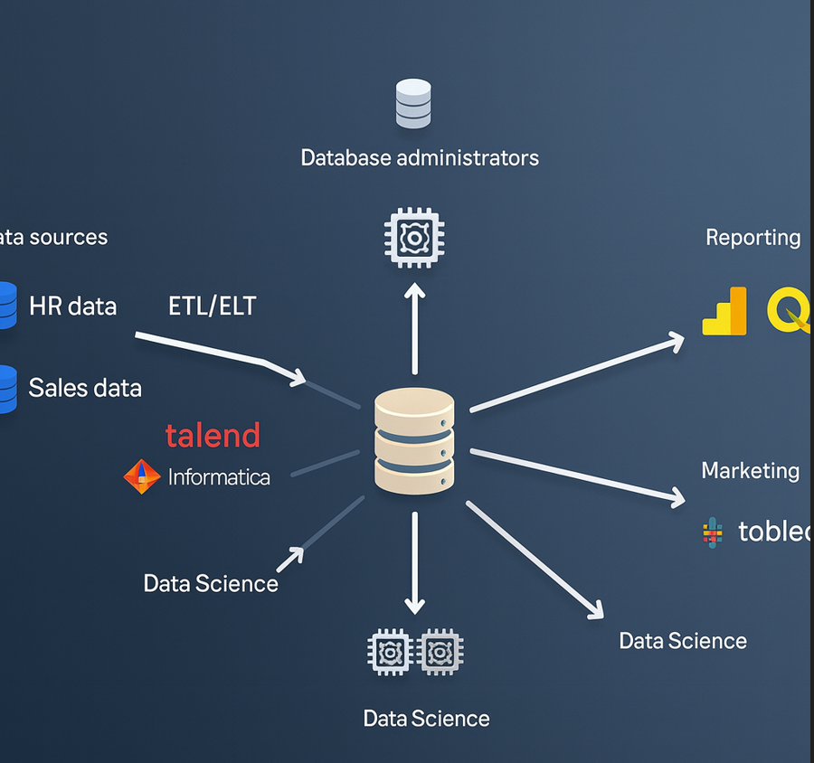

# **Snowflake – End-to-End Workflow**

The diagram illustrates how Snowflake acts as a **central data platform**, integrating multiple **data sources**, **ETL/ELT pipelines**, **data science tools**, and **BI/reporting applications**.  

---

## **1. Data Sources**
- **Examples**: HR Data, Sales Data, ERP, CRM systems, IoT devices, flat files, cloud storage.  
- Data originates from different business functions and systems.  
- Snowflake supports structured, semi-structured (JSON, Avro, Parquet), and unstructured data.  

---

## **2. ETL / ELT**
- Tools like **Talend** and **Informatica** handle data integration.  
- **ETL (Extract, Transform, Load)**: Transform before loading into Snowflake.  
- **ELT (Extract, Load, Transform)**: Load raw data into Snowflake first, then transform inside using Snowflake’s compute power (preferred modern approach).  
- This ensures data is cleaned, standardized, and ready for analytics.  

---

## **3. Centralized Snowflake Data Warehouse**
- Acts as the **single source of truth**.  
- Separates **storage** (data lake-like) from **compute** (virtual warehouses).  
- Supports **scalability**, **concurrency**, and **performance tuning** (scaling up, scaling out, cache usage).  
- Data is secured, governed, and available to multiple teams simultaneously.  

---

## **4. Data Consumers**

### **a. Database Administrators**
- Manage security, user access, performance tuning, resource monitoring, and governance.  

### **b. BI & Reporting Tools**
- Examples: **Power BI**, **Qlik**, **Tableau**.  
- Used by business analysts and managers to build dashboards and reports.  
- Connect directly to Snowflake for **real-time insights**.  

### **c. Marketing Teams**
- Use BI dashboards (e.g., Tableau) to track campaigns, customer segmentation, and KPIs.  

### **d. Data Science & Advanced Analytics**
- Tools like **Apache Spark** and **Python** connect to Snowflake for ML/AI and predictive modeling.  
- Data scientists can pull large datasets into their workflows and push results back to Snowflake.  

---

## **5. Business Value**
- **Unified Platform**: Centralizes enterprise data.  
- **Collaboration**: Supports BI, reporting, marketing, data science, and administration simultaneously without contention.  
- **Scalability**: Elastic compute ensures smooth performance across workloads.  
- **Flexibility**: Supports ETL, ELT, batch, and real-time ingestion.  

---

✅ **Summary**:  
Snowflake integrates **data ingestion (ETL/ELT)**, **storage**, **compute**, and **analytics** into a single cloud-native platform. This architecture enables **database administrators, BI analysts, marketers, and data scientists** to collaborate effectively, each using their preferred tools while leveraging a **common, secure data source**.  

- Identify and classify groups of workload/users
- BI team, data science team, marketing department
  

- For every class of workload & assign users

- Avoid underitilization

- work pattern can change
