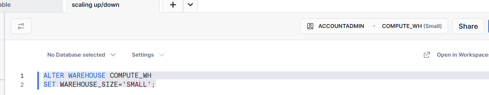
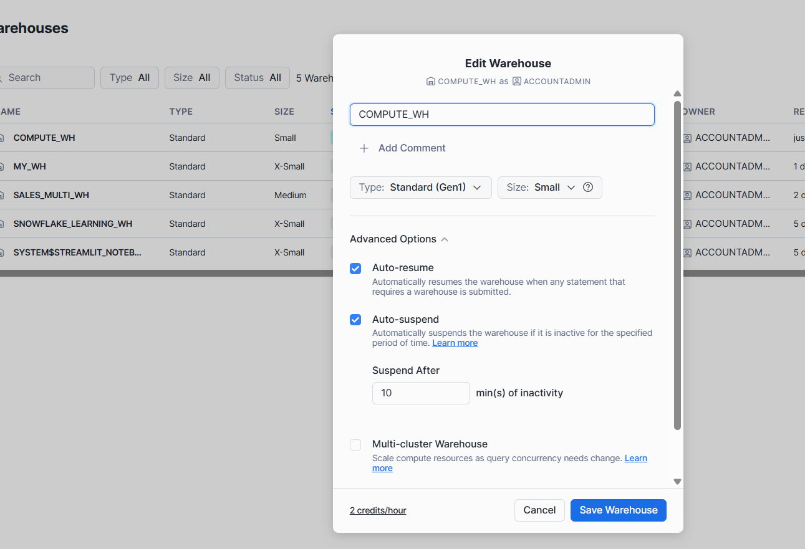
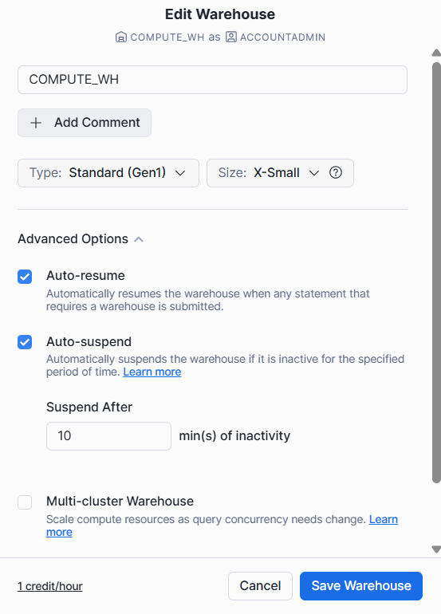

#  Scaling up/Down

- Change the size of the virtual Warehouse Depending on different workloads in different periods.
- Use case
- ETL At Certain times (For an example between 4:00 PM and 8:00 PM).
- Special business event with more workload
  
- **Note:** Common scenario is increased query complexity not more user (then scaling out would be better)
  
```SQL
ALTER WAREHOUSE COMPUTE_WH
SET WAREHOUSE_SIZE='SMALL';
```


Admin -> Warehouses 



