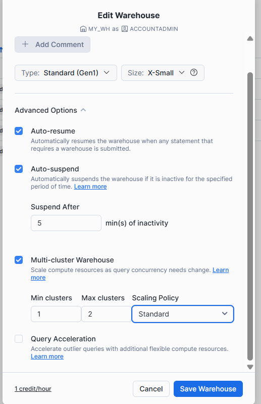
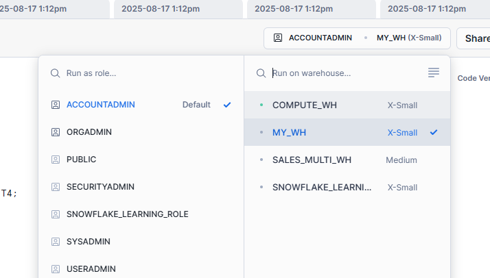
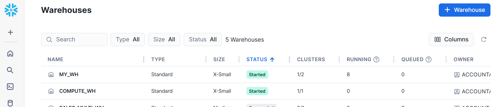
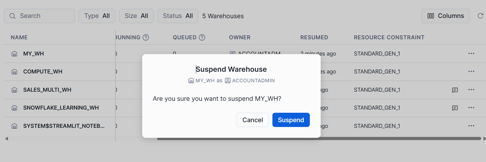
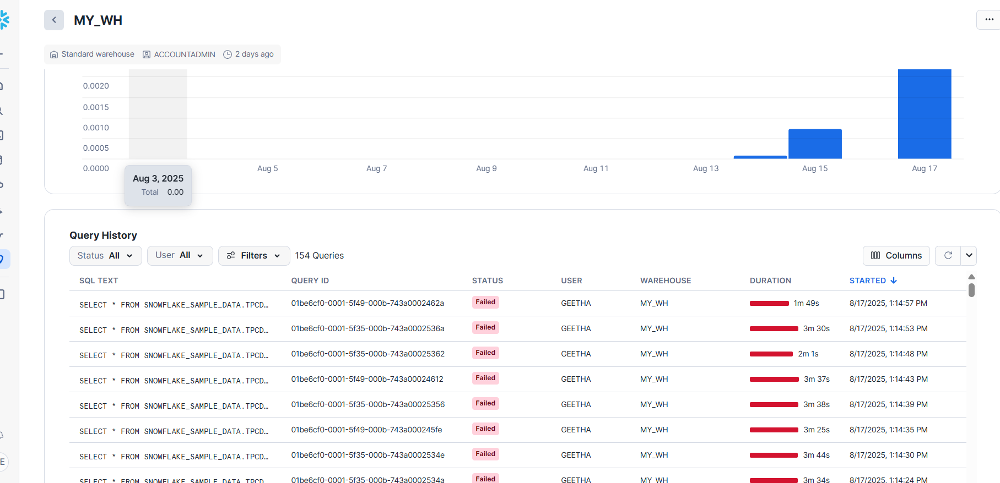

## Scaling up
- Increasing the size of virtual warehouses
- More complex query

## Scaling out
- Using addition warehouses/Multicluster warehouses
- More concurrent users/Queries
- Handling performance related to large number of concurrent users.
- Automation the process if you have fluctuating number of users

Two types of Scaling policies
1. standard
2. economy

## Consideration
If you use at least Enterprise edition all warehouses should be multi-cluster

- **Minimum:** default should be one
- **Maximum:**  can be very high




open 7-8 ne worksheet 

paste the below query i all worksheet

```sql

SELECT * FROM SNOWFLAKE_SAMPLE_DATA.TPCDS_SF100TCL.WEB_SITE T1
CROSS JOIN SNOWFLAKE_SAMPLE_DATA.TPCDS_SF100TCL.WEB_SITE T2
CROSS JOIN SNOWFLAKE_SAMPLE_DATA.TPCDS_SF100TCL.WEB_SITE T3
CROSS JOIN (SELECT TOP 57 * FROM SNOWFLAKE_SAMPLE_DATA.TPCDS_SF100TCL.WEB_SITE)  T4;
```

Execute the query in all 8 worksheet .Make sure You choose the My_DB

When more queries is running automatically it scaling up .Now it is running in 2 clusters


let us suspend all the MY_WH  warehouse to avoid the cost



To verify any query is running
Admin -> warehouse -> MY_WH 
