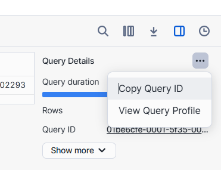

Catching will be enabled automatically by Snowflake


# Maximize caching
```sql
SELECT AVG(C_BIRTH_YEAR) FROM SNOWFLAKE_SAMPLE_DATA.TPCDS_SF100TCL.CUSTOMER
```


While first time execution of this query it takes nearly 1.7 seconds It load nearly 65 million records





While you are executing the same query second time It takes very minimal time from where it Loading the data Means it is from the cache

Now click on query profiling and have a look It took data from where


```sql
// Setting up an additional user
CREATE ROLE DATA_SCIENTIST;
GRANT USAGE ON WAREHOUSE COMPUTE_WH TO ROLE DATA_SCIENTIST;

CREATE USER DS1 PASSWORD = 'DS1' LOGIN_NAME = 'DS1' DEFAULT_ROLE='DATA_SCIENTIST' DEFAULT_WAREHOUSE = 'DS_WH'  MUST_CHANGE_PASSWORD = FALSE;
GRANT ROLE DATA_SCIENTIST TO USER DS1;

```

Open incognito window for login
project -> worksheet -> run the same query again with comput_wh and check .It tooks 1s time to retrive data which means cache availble for 24 hours.


