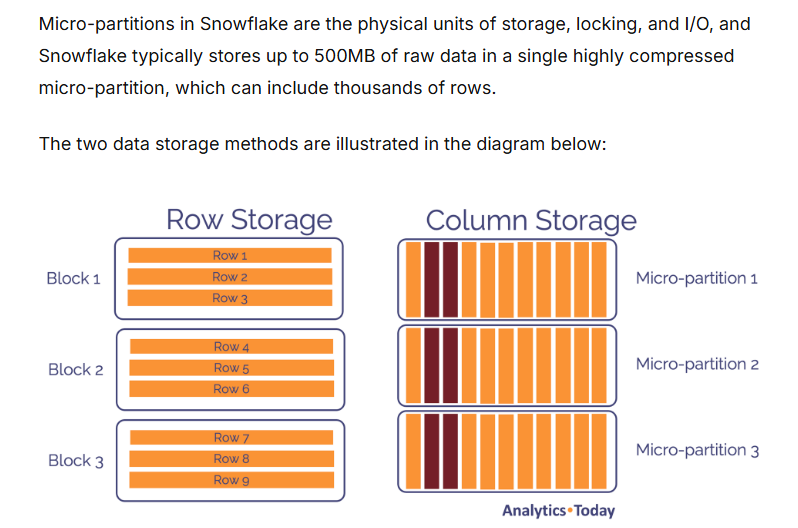
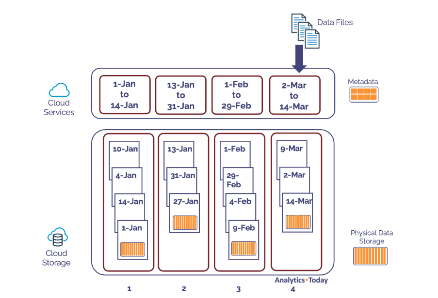
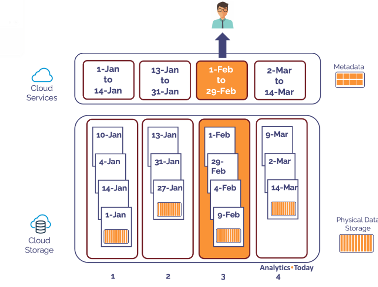
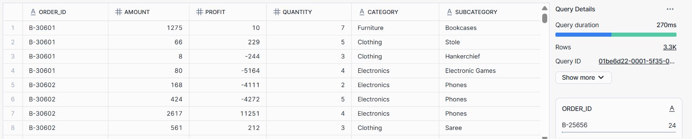
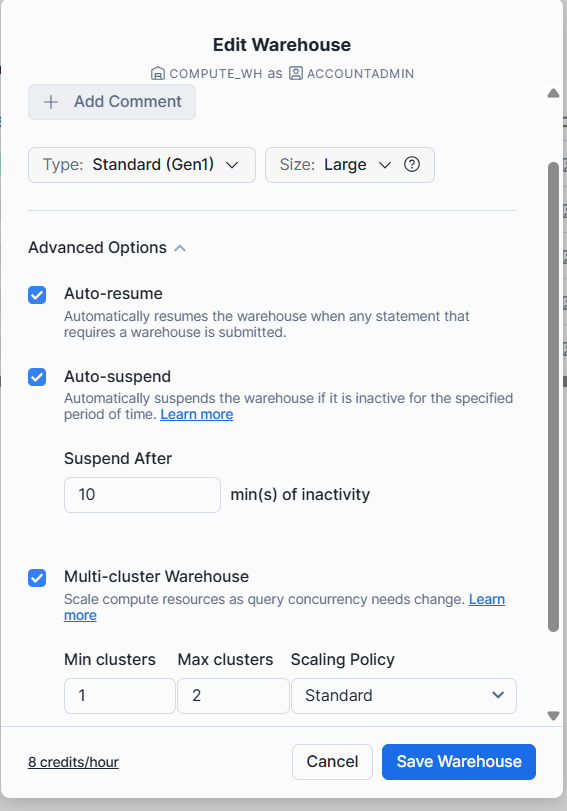

# Clustering in Snowflake

## What is a cluster key?

- Subset of rows to locate the data in micro partition.
- For large tables this improves the scan efficiency in our queries

- Cluster keys are maintained automatically by the snowflake.
- In general Snowflake produces well-clustered tables.
- Cluster keys are not always idle and can change over the time.
- Manually customize these cluster keys

## Micro partition




- Clustering is not for all tables
- Mainly for very large tables of multiple terabytes can benefit.
## How to cluster?
- Columns that are used most frequently in **WHERE** class (Often data columns for event tables).

- If you typically use philtres on two columns then the table can also benefit from 2 cluster keys.

- Column that is frequently used in joins.
- Large enough number of distinct values To enable effective grouping
- small enough number of distinct values to allow effective grouping

```sql
// Publicly accessible staging area    

CREATE OR REPLACE STAGE MANAGE_DB.external_stages.aws_stage
    url='s3://bucketsnowflakes3';

// List files in stage

LIST @MANAGE_DB.external_stages.aws_stage;

//Load data using copy command

COPY INTO OUR_FIRST_DB.PUBLIC.ORDERS
    FROM @MANAGE_DB.external_stages.aws_stage
    file_format= (type = csv field_delimiter=',' skip_header=1)
    pattern='.*OrderDetails.*';
    
```
`SELECT * FROM OUR_FIRST_DB.PUBLIC.ORDERS;`

```SQL
// Create table

CREATE OR REPLACE TABLE ORDERS_CACHING (
ORDER_ID	VARCHAR(30)
,AMOUNT	NUMBER(38,0)
,PROFIT	NUMBER(38,0)
,QUANTITY	NUMBER(38,0)
,CATEGORY	VARCHAR(30)
,SUBCATEGORY	VARCHAR(30)
,DATE DATE)   ; 


INSERT INTO ORDERS_CACHING 
SELECT
t1.ORDER_ID
,t1.AMOUNT	
,t1.PROFIT	
,t1.QUANTITY	
,t1.CATEGORY	
,t1.SUBCATEGORY	
,DATE(UNIFORM(1500000000,1700000000,(RANDOM())))
FROM ORDERS t1
CROSS JOIN (SELECT * FROM ORDERS) t2
CROSS JOIN (SELECT TOP 100 * FROM ORDERS) t3;

```
Insert query will take nearly more than 6 minutes to load the data. As the **cluster size is xtra-small** it is taking more time. later we will **change the cluster size as large or medium** then insert the same Recording to the table and find the difference how long time it takes to load the data.

Now i am chaing the size of warehouse and enable multi-cluster

// Query Performance before Cluster Key

SELECT * FROM ORDERS_CACHING  WHERE DATE = '2020-06-09';


// Adding Cluster Key & Compare the result

ALTER TABLE ORDERS_CACHING CLUSTER BY ( DATE ) ;

SELECT * FROM ORDERS_CACHING  WHERE DATE = '2020-01-05';


// Not ideal clustering & adding a different Cluster Key using function

SELECT * FROM ORDERS_CACHING  WHERE MONTH(DATE)=11;

ALTER TABLE ORDERS_CACHING CLUSTER BY ( MONTH(DATE) );


