1. Login to Azure Portal
2. create storage account (snowflakehexasa)
3. create container (snowpipecsv)

go to snowflake web UI (or) snowsight

```sql
CREATE OR REPLACE DATABASE SNOWPIPE;

-- create integration object that contains the access information
CREATE OR REPLACE STORAGE INTEGRATION azure_snowpipe_integration
  TYPE = EXTERNAL_STAGE
  STORAGE_PROVIDER = AZURE
  ENABLED = TRUE
  AZURE_TENANT_ID =  '<tenant id>'
  STORAGE_ALLOWED_LOCATIONS = ( 'azure://<storageaccountname>.blob.core.windows.net/<containername>');

  ```
 `DESC STORAGE integration azure_snowpipe_integration;`
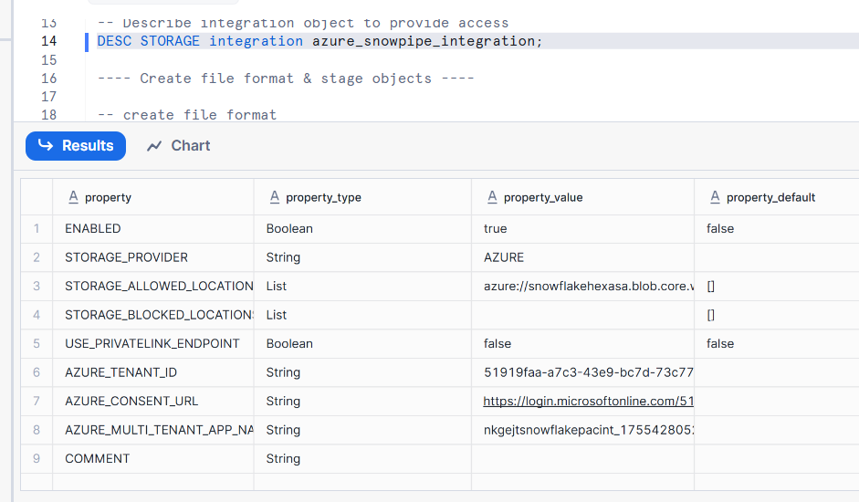
 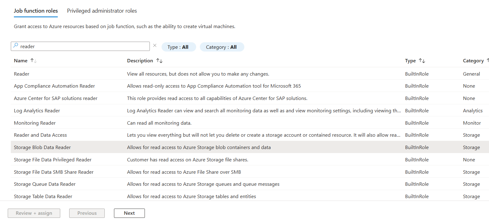

 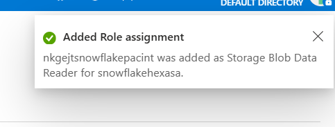


 ```sql
-- create file format

create or replace file format snowpipe.public.fileformat_azure
    TYPE = CSV
    FIELD_DELIMITER = ','
    SKIP_HEADER = 1;

-- create stage object
create or replace stage snowpipe.public.stage_azure
    STORAGE_INTEGRATION = azure_snowpipe_integration
    URL = 'azure://snowflakehexasa.blob.core.windows.net/snowpipecsv'
    FILE_FORMAT = fileformat_azure;
    

-- list files
LIST @snowpipe.public.stage_azure;


 ```

 # Craete a notifications

 - -> goto azure portal
 - -> Data storage 
 - -> Queue
 - -> create queue (snowpipequeue)
 - 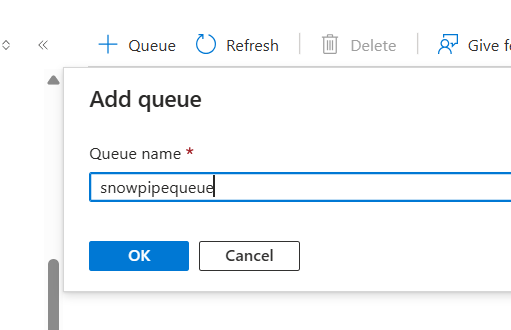
 -  -> goto storage account overview 
 -  Goto Events (left blade or pane)
 -  -> Name :snowpipenotification
 -  ->System speific Name :snowpipenotification
 -  ->Filter to Event Type :Blob Created (✔️)
 -  ->Endpoint Type : Storage Queue
 -  -> select endpoint
 -  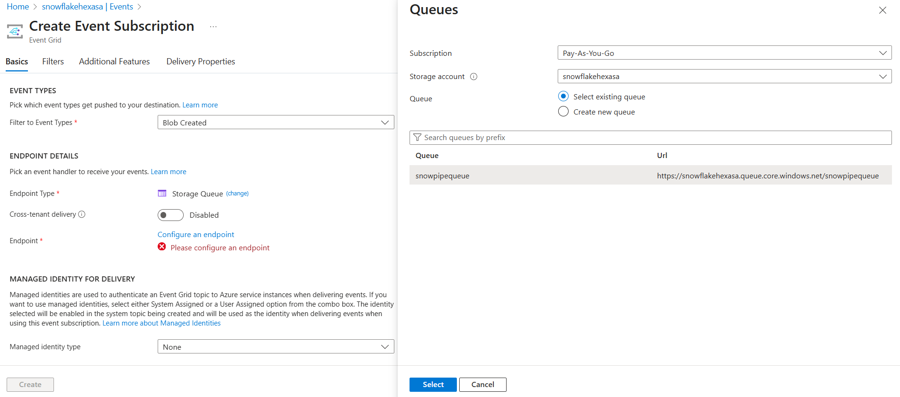
 -  create ->
 -  you will get an error as it is not registered
-  
Home on azure portal -> in a new tab 
- -> subscriptions
- -> select your subscriptions
- -> settings -> 
- -> My permissions 
- -> Resource providers
- 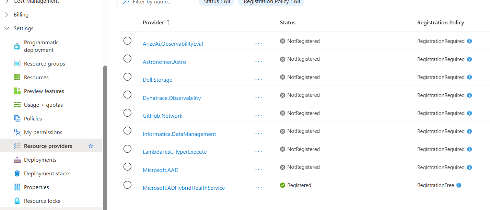
- 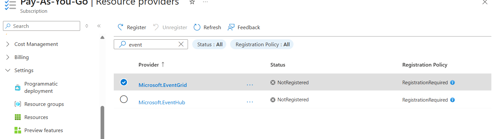
- click on register
- 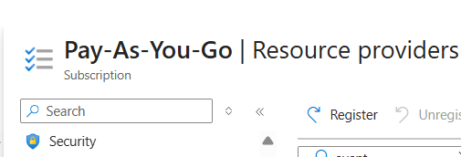
- 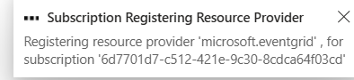

After registered 

- -> Go back to Event subscription
- select the resource 
- create
- 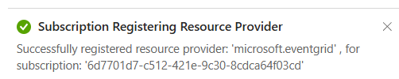
- 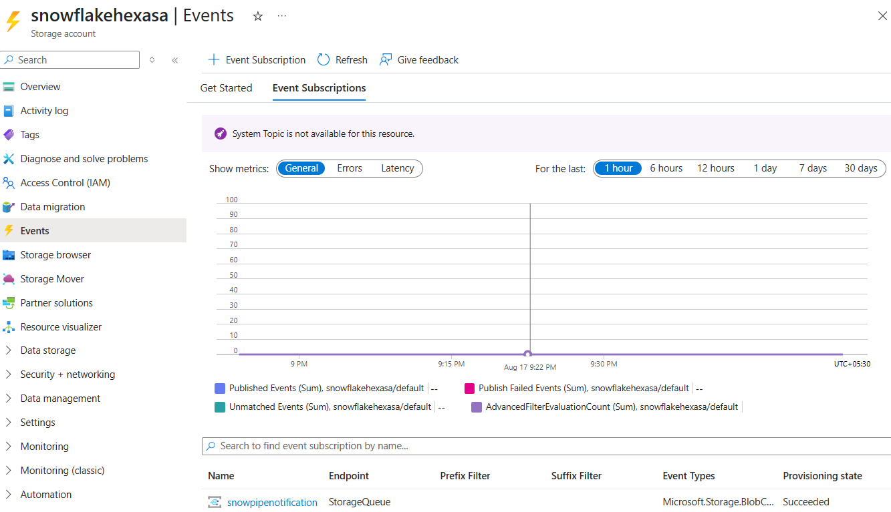

Copy the queue url
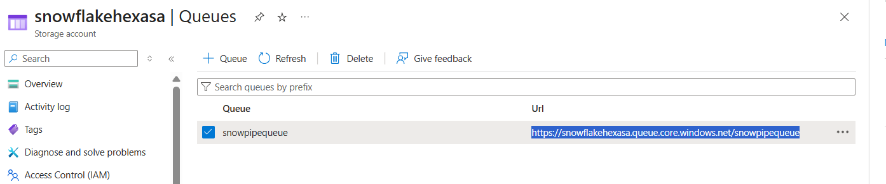

```sql
CREATE OR REPLACE NOTIFICATION INTEGRATION snowpipe_event
  ENABLED = true
  TYPE = QUEUE
  NOTIFICATION_PROVIDER = AZURE_STORAGE_QUEUE
  AZURE_STORAGE_QUEUE_PRIMARY_URI = 'https://<your-container-url>'
  AZURE_TENANT_ID = '<your-tenant-id>';
  
  
  -- Register Integration
  
  DESC notification integration snowpipe_event;
  
  
  
```
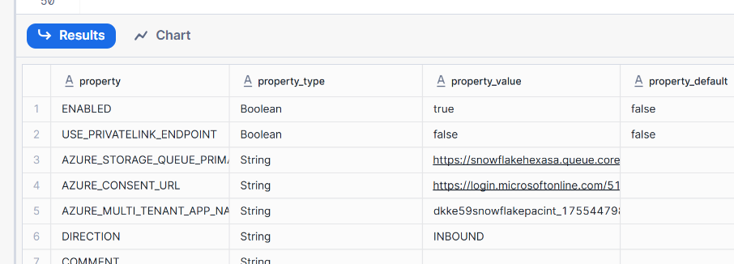
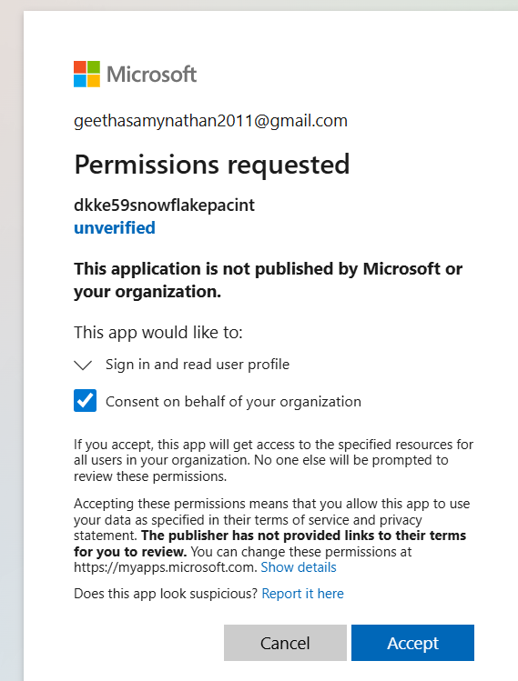

Now we want to add Role Assignment

- -> goto StorageAccount
- -> Allow Access (IAM)
- => Add Role Assignment
- -> queue
- 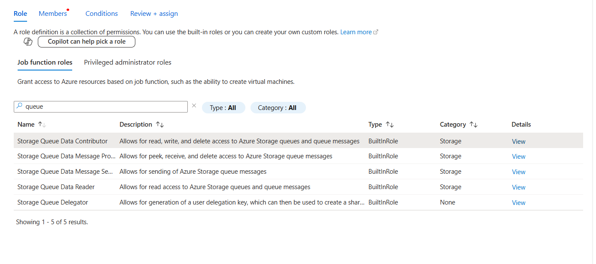
- 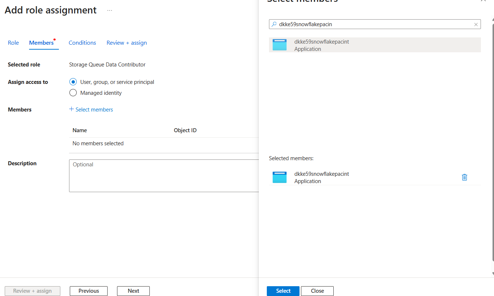
- Review and Assign

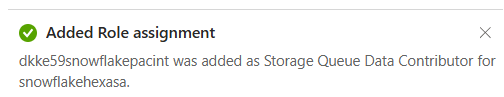
