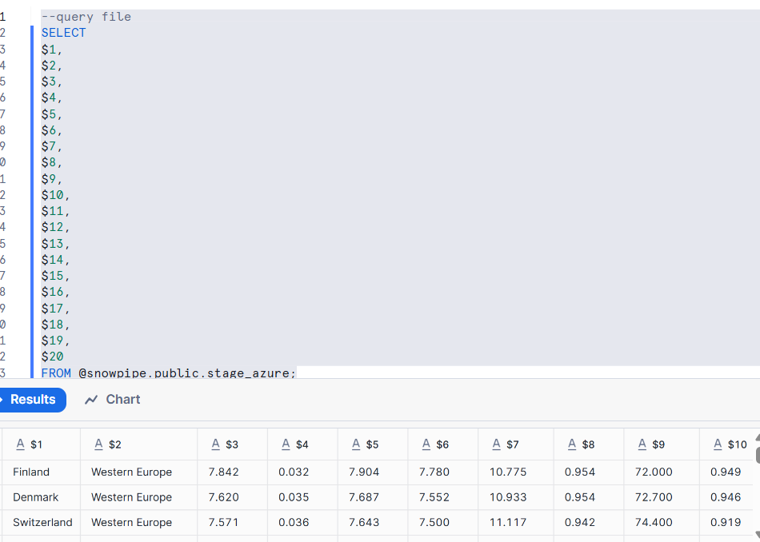
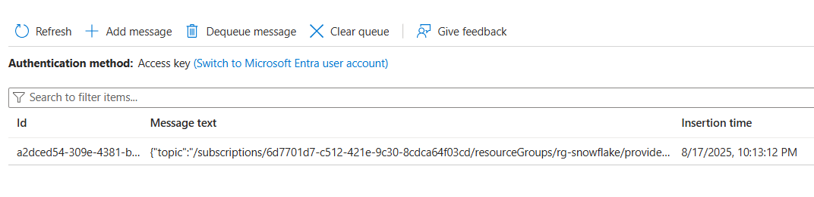

in the previous session we did set up storage, event notification,...

Let us Set the Pipe
```sql
--query file
SELECT 
$1,
$2,
$3,
$4,
$5,
$6,
$7,
$8,
$9,
$10,
$11,
$12,
$13,
$14,
$15,
$16,
$17,
$18,
$19,
$20
FROM @snowpipe.public.stage_azure;
```
Before you are executing the command upload the data into azure container

Then execute the above query 


```sql


-- create destination table
create or replace table snowpipe.public.happiness (
    country_name varchar,
    regional_indicator varchar,
    ladder_score number(4,3),
    standard_error number(4,3),
    upperwhisker number(4,3),
    lowerwhisker number(4,3),
    logged_gdp number(5,3),
    social_support number(4,3),
    healthy_life_expectancy number(5,3),
    freedom_to_make_life_choices number(4,3),
    generosity number(4,3),
    perceptions_of_corruption number(4,3),
    ladder_score_in_dystopia number(4,3),
    explained_by_log_gpd_per_capita number(4,3),
    explained_by_social_support number(4,3),
    explained_by_healthy_life_expectancy number(4,3),
    explained_by_freedom_to_make_life_choices number(4,3),
    explained_by_generosity number(4,3),
    explained_by_perceptions_of_corruption number(4,3),
    dystopia_residual number (4,3));
    


COPY INTO HAPPINESS
FROM @snowpipe.public.stage_azure;

SELECT * FROM snowpipe.public.happiness;

TRUNCATE TABLE snowpipe.public.happiness;
```

In the above we have seen the data using Copy command. 
Actually we don't want any manual intervention to copy.

so goto aure portal 
->  delete the file you uploaded
-> goto queue 
->  dequeue which already created

 


 ```sql
-- create pipe
  create pipe azure_pipe
  auto_ingest = true
  integration = 'SNOWPIPE_EVENT'
  as
  copy into snowpipe.public.happiness
  from @snowpipe.public.stage_azure;
```
execute the above query in snowflake

 Now in azure container we will upload the data file and let see
  SELECT SYSTEM$PIPE_STATUS( 'AZURE_PIPE' );
   
```