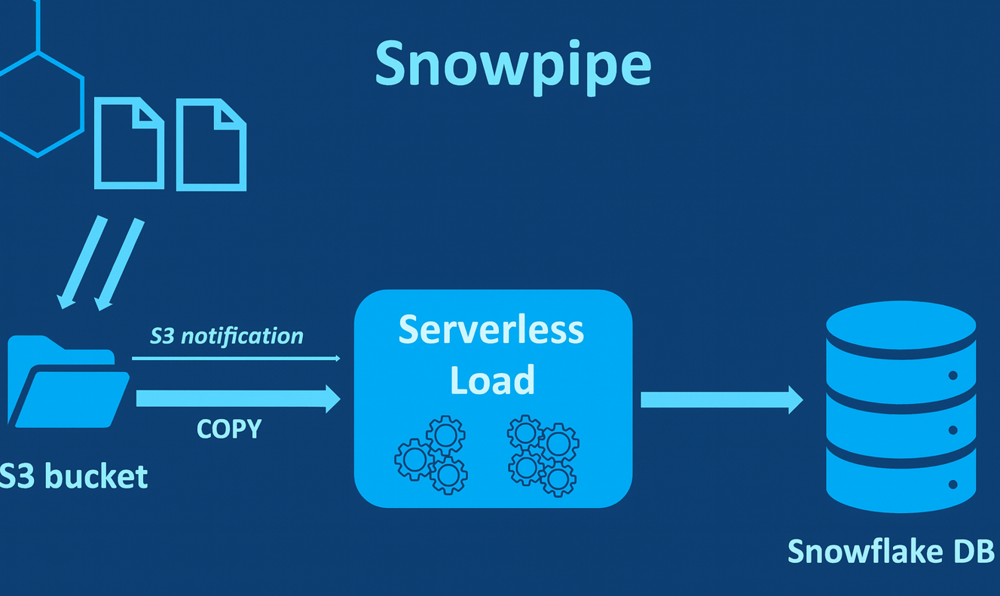

## 1. What is Snowpipe?  
- **Snowpipe** is a **continuous data ingestion service** in **Snowflake** that allows loading data **automatically and near real-time** as soon as files appear in a stage (cloud storage like AWS S3, Azure Blob, or GCS).  
- Unlike the traditional `COPY INTO` command (manual or scheduled loads), Snowpipe **automates the process** and provides **serverless data loading**.  
- It uses **cloud event notifications** (from S3, Blob Storage, or GCS) or a **REST API** to detect new files and ingest them into Snowflake tables.  

👉 Think of it as a **data pipeline service within Snowflake** that *continuously listens for new data and loads it without human intervention*.  

---

## 2. Why Use Snowpipe?  

### ✅ Key Reasons to Use Snowpipe:  
1. **Continuous & Near Real-time Loading**  
   - Traditional batch loads may introduce delays.  
   - Snowpipe loads data as soon as it lands in the stage, enabling **real-time analytics**.  

2. **Automation**  
   - No need to manually execute `COPY INTO`.  
   - Snowpipe listens to cloud storage events and triggers ingestion automatically.  

3. **Cost Efficiency**  
   - Snowpipe is **serverless** — you only pay for the compute resources Snowflake uses internally to load the data.  
   - No need to manage or keep a warehouse running.  

4. **Scalability**  
   - Handles large volumes of data by ingesting files in parallel.  
   - Automatically scales with workload demand.  

5. **Reliability & Fault Tolerance**  
   - Automatically tracks which files are loaded.  
   - Ensures **exactly-once ingestion** (avoids duplicates).  

6. **Integration with Cloud Services**  
   - Works seamlessly with **AWS S3 events, Azure Event Grid, or Google Cloud Pub/Sub**.  
   - Can also be triggered programmatically via **Snowpipe REST API**.  

---

## 3. Real-World Use Cases of Snowpipe  
- **Streaming IoT Data**: Sensors generating logs every few seconds can be ingested continuously.  
- **Application Logs**: Automatically capture and load server logs from cloud storage into Snowflake for monitoring.  
- **Customer Transactions**: Retail/e-commerce transactions streamed into Snowflake for fraud detection and dashboards.  
- **Social Media Data**: Continuous ingestion of tweets, likes, or user interactions for trend analysis.  

---

## 4. Difference Between COPY INTO vs. Snowpipe  

| Feature              | COPY INTO Command | Snowpipe |
|----------------------|------------------|-----------|
| **Type**            | Manual or scheduled | Continuous, automated |
| **Latency**         | Batch (minutes/hours) | Near real-time (seconds) |
| **Compute**         | Requires a running warehouse | Serverless (managed by Snowflake) |
| **Best For**        | Periodic batch loads | Streaming / real-time loads |

---

✅ **Summary**:  
Snowpipe is **Snowflake’s continuous data ingestion service** designed for **real-time analytics** by automatically loading data from cloud storage into Snowflake tables. It eliminates manual intervention, reduces latency, and ensures **scalable, reliable, and cost-effective ingestion**.  

